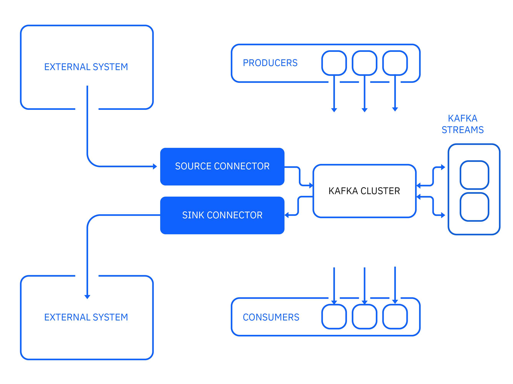
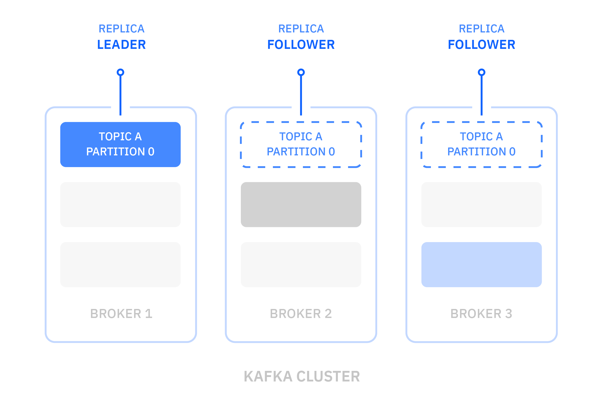

# LAB 00 - Kafka Intro

[Apache Kafka](https://kafka.apache.org/) is designed and optimized to be a high-throughput, low-latency, fault-tolerant, scalable platform for handling real-time data feeds. Kafka does this all amazingly well and has established itself as a core building block for many of today's event streaming applications.

In this article, you will learn some of the common use cases and core concepts for Apache Kafka. You'll also learn how producers and consumers work and how Kafka Streams and Kafka Connect can be used to create powerful data streaming pipelines.

The following diagram describes the core components that connect to Kafka and the data flow between them:

## Common use cases

Apache Kafka project is a powerful and scalable technology that is widely adopted for a variety of use cases, including these use cases:

- **Messaging** - Kafka offers high throughput, built-in partitioning, replication, and fault-tolerance, which makes it a good choice when handling large-scale messaging.
- **Operational monitoring** - Kafka can provide centralized feeds of metric and logging data from multiple data sources. It offers lower-latency processing and easier support for multiple data sources and distributed data consumption.
- **Stream processing** - Many users process data in processing pipelines that consist of multiple stages, where raw input data is consumed from Kafka topics and then aggregated, enriched, or otherwise transformed into new topics for further consumption or follow-up processing. With such processing pipelines, you can build cost-effective, resilient, and scalable real-time data processing solutions.
- **Microservices** - Kafka can help simplify complex communication between microservices by decoupling senders from receivers with asynchronous messaging.

There are many more use cases for Kafka, such as website activity tracking and event sourcing, and the list of use cases is still expanding as Kafka adoption is rapidly growing.

## Key concepts of Apache Kafka

Now that we know the common use cases for Kafka, let's explore some of the key concepts to understand how it works.

### Brokers

Kafka is run as a cluster on a set of servers, which are called brokers. A cluster has a minimum of 3 brokers as shown in the following example:

### Messages

A message is a unit of data in Kafka. Each message is comprised of two parts: key and value. The key is commonly used for data about the message and the value is the body of the message. Kafka uses the terms message and record interchangeably.

### Topics and partitions

Each topic is a named stream of messages. A topic is made up of one or more partitions. The messages on a partition are ordered by a number called the offset.

By having multiple partitions distributed across the brokers, the scalability of a topic is increased. If a topic has more than one partition, it allows data to be fed through in parallel to increase throughput by distributing the partitions across the cluster.

Messages on topics are not kept forever. Kafka will remove old messages. You can specify whether you want to remove messages after a certain amount of time or when the log reaches a certain size.

### Replication

To improve availability and resiliency, each topic can be replicated onto multiple brokers. For each partition, one of the brokers is the leader, and the other brokers are the followers.

All produce and consume requests for the partition are handled by the leader replica. The followers replicate the partition data from the leader with the aim of keeping up with the leader. A follower replica that is keeping up with the partition leader is "in-sync". All the replicas should usually be in-sync but it's acceptable for a replica to be temporarily not in-sync while it's catching up after a failure.

If the leader for a partition fails, one of the followers with an in-sync replica automatically takes over as the partition's leader. Any follower with an in-sync replica can become the leader without losing any messages. In practice, every server is the leader for some partitions and the follower for others. The process of designating a new leader replica is called a leadership election. The leadership of partitions is dynamic and changes as servers come and go.

In the following example, broker 1 is the leader for partition 1 of topic A.

When broker 1 goes offline, broker 2 becomes the leader for the partition automatically.

Applications do not need to take specific actions to handle the change in the leadership of a partition. The Kafka client library automatically reconnects to the new leader, although you will see increased latency while the cluster settles.

## Apache Kafka clients

Let's now learn about the Kafka clients that allow applications to send, receive, and process data from and to Kafka.

### Producers

A producer is an application that publishes streams of messages to Kafka topics. A producer can publish to one or more topics and can optionally choose the partition that stores the data.

When a producer connects to Kafka, it makes an initial bootstrap connection. This connection can be to any of the brokers in the cluster. The producer requests information about the topic that it wants to publish to so that it knows which broker and partition it needs to connect to.

Then, the producer establishes another connection to the partition leader and can begin to publish messages. These actions happen automatically internally when your producer connects to the Kafka cluster.

When a message is sent to the partition leader, that message is not immediately available to consumers. The leader appends the message to the partition, assigning it the next offset number for that partition. After all the followers have replicated the message and acknowledged that they've written the message to their replicas, the message is now committed and becomes available for consumers.

#### Message ordering

Kafka generally writes messages in the order that they are sent by the producer. However, there are situations where retries can cause messages to be duplicated or reordered. If you want a sequence of messages to be sent in order, it's very important to ensure that they are all written to the same partition by giving the same key because this is the only way to guarantee message ordering.

The producer is also able to retry sending messages automatically. It's often a good idea to enable this retry feature because the alternative is that your application code has to perform any retries itself. The combination of batching in Kafka and automatic retries can have the effect of duplicating messages and reordering them.

### Consumers

A consumer is an application that consumes streams of messages from Kafka topics. A consumer can read messages from one or more topics and processes them.

When a consumer connects to Kafka, it makes an initial bootstrap connection. This connection can be to any of the servers in the cluster. The consumer requests information about the topic that it wants to consume from so that it knows which broker and partition it needs to connect to.

Then the consumer establishes another connection to the partition leader and can begin to consume messages. These actions happen automatically internally when your consumer connects to the Kafka cluster.

A consumer is normally a long-running application. A consumer requests messages from Kafka by calling Consumer.poll(...) regularly. The consumer calls poll(), receives a batch of messages, processes them promptly, and then calls poll() again.

When a consumer processes a message, the message is not removed from its topic. Instead, consumers can choose from several ways of letting Kafka know which messages have been processed. This process is known as "committing the offset."

The difference between a consumer's current position and the newest message on a partition is known as the offset lag. If the lag increases over time, it is a sign that the consumer is not able to keep up. Over the short term, this is not an issue, but eventually the consumer could miss messages if the retention period is exceeded.

#### Consumer Groups

A consumer group contains one or more consumers that work together to process the messages. The messages from a single partition are processed by one consumer in each group.

At any time, each partition is assigned to only one consumer in the group. This assignment ensures that the messages on each partition are processed in order.

If there are more partitions than consumers in a group, some consumers have multiple partitions. If there are more consumers than partitions, some consumers have no partitions. Therefore the number of partitions influences the balancing of workload among consumers.

Each consumer group has a server in the cluster called the coordinator that is responsible for assigning partitions to the consumers in the group. This responsibility is spread across the servers in the cluster to even the load. The assignment of partitions to consumers can change at every group rebalance.

When one of the following changes takes place in a consumer group, the group rebalances by shifting the assignment of partitions to the group members to accommodate the change:

- A consumer joins the group
- A consumer leaves the group
- A consumer is considered as no longer live by the coordinator
- New partitions are added to an existing topic

For each consumer group, Kafka remembers the committed offset for each partition being consumed.

### Kafka Connect

Kafka Connect is part of the Apache Kafka project and allows connecting external systems to Kafka.

It consists of a runtime that can run connectors to copy data to and from a cluster. Its main characteristics are:

- Scalability: It can easily scale from a single worker to many.
- Reliability: It automatically manages offsets and the lifecycle of connectors.
- Extensibility: The community has built connectors for most popular systems.

IBM has connectors for [MQ](https://cloud.ibm.com/docs/EventStreams?topic=EventStreams-mq_connector) and [Cloud Object Storage](https://cloud.ibm.com/docs/EventStreams?topic=EventStreams-cos_connector). Many connectors are available and are often open source.

> For a more extensive list of Kafka Connect connectors (Supported by IBM & by the community), navigate to the [Connector Catalog](https://ibm.github.io/event-automation/connectors/)
