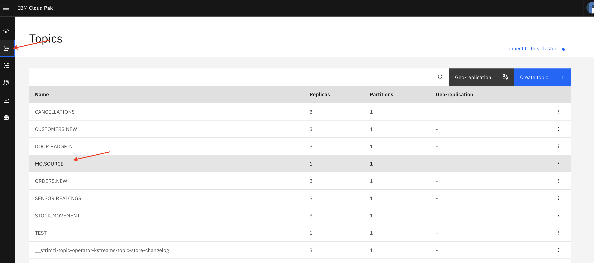

# LAB 01A MQ to EventStreams

This lab demonstrates the Streaming Queue feature added to MQ in the 9.2.3.0 CD release. Streaming Queues allow you to configure any local or model queue with the name of second named queue. This second queue is referred to as a Stream Queue.

When messages are put to the original queue, a duplicate copy of each message is also placed on the stream queue. The Streaming Queue feature allows you to create a duplicate stream of messages which can be used for later analysis, logging, or storage without affecting the business applications using the original queue.

MQ Streaming is designed to give you a convenient way of capturing a duplicate stream of messages in order to:
- Streaming messages to Apache Kafka using the Kafka Connect source connector for IBM MQ.
- Performing analysis on the data going through the system.
- Storing messages for recovery at a later time.
- Capturing a set of messages to use in development and test systems.
- Consuming IBM MQ event messages from the system event queues, and sending additional copies to other queues or topics.

Because duplicate messages are delivered to the stream queue at put time, messages already on the original queue when the stream queue is defined are not sent to the duplicate queue.

The messages sent to the stream queue are almost identical with a small number of exceptions. For example, the following aspects of the stream queue messages are identical to the original message:
- Message ID
- Correlation ID
- Message Properties
- Application Data

The environment has already been configured with a MQ Kafka connect source.

The queue used as source in the environment is **LQ.KAFKA.SOURCE** and the target TOPIC is **MQ.SOURCE**.  
Any messages that is putted in the queue LQ.KAFKA.SOURCE will be get by Kafka Connect and push into the TOPIC MQ.SOURCE.  

In this lab you will 
- create a local queue into a provided queue manager
- put and get messages out of the queue using a REST API. This will show that reading a message from the queue is destructive.
- configure the queue created to send a duplicate message in the streaming queue. This is done on MQ configuration ony and doesn't require to change any line of the application code.
- put and get messages to the created queue 
- check that the message that you send is also available in the EventStreams queue

You can find additional details in the documentation at [info on MQ Streaming](https://www.ibm.com/docs/en/ibm-mq/9.3?topic=scenarios-streaming-queues)

## Create a Queue

The first part of the lab is to create the queue that you will use for your application. 

1. Open the MQ Web UI:

[MQ Console](https://mq-demo-rest-cp4i-mq.apps.melch.coc-ibm.com/ibmmq/console)

2. Click on Manage in the left menu

3. Click on the **Local Queue Manager** (see previous screenshot)

In the local queue manager, the queue manager **QMGRDEMO** is listed

4. Click on the queue manager **QMGRDEMO**

You have a view of all the queues that are available on this queue manager.
You will create a queue for your application.

5. Click **Create**

6. Choose a **LOCAL** queue

7. Provide a queue name

> [!NOTE]
> For this lab, follow the following pattern for the queue name: \*LQ.APP.USER**\*X**. Where X is the number that has been assigned to you: **LQ.APP.USER1**.

8. Click Create

9. Click on your queue

You will see that the queue is empty.

## Send/receive MQ message

We have exposed the MQ REST API through API Connect to send and receive MQ messages.  
The REST API is available on the developer portal of API Connect.

1. Navigate to the API Connect Developer portal

Navigate to the developer portal and you should be navigated automatically to the login page, if you didn't login previously.

[API Connect Developer Portal](https://apim-demo-ptl-portal-web-cp4i-apic.apps.melch.coc-ibm.com/melch-admin-porg/sandbox)

1. Enter the provided _username & password_ and click **Sign in**.

> [!IMPORTANT]  
> UserName have the following pattern: devuser**x**  
> where x is the number that has been provided to you. It is not possible to have two sessions opened as the same time with the same user. Please take the user that has been provided.  
> The password should be provided by the assistant.

You should now be logged in and see the _API Connect Developer Portal_.

3. Select the **MQ Utils** product.

4. Select the **MQ-QMGRDEMO** API

5. Select the **POST /stringMessafe**

6. Click on **Try it**

7. Provide the **QueueName** and a **message**

The queue name should be the same name of the queue that you created earlier (*LQ.APP.USER***X***).   
For the message, you may use a JSON message with a content that you can recognize. 
For example you can provide your user name that you are using as shown in the snapshot:

8. Click on **send**

The response is provided here with a status code 201 (created), meaning that the message has been successfully put into the queue.

> [!NOTE]
> Don't close the page as we will use it to send and receive other messages in this part and once you have the queue for streaming.

9. Navigate back to the MQ console and select your queue

[MQ Console](https://mq-demo-rest-cp4i-mq.apps.melch.coc-ibm.com/ibmmq/console)

You message should be visible.

> If you left your MQ UI on the queue view, you can refresh the content using the refresh button located just on the left of the create button.

10. Navigate back to the API Connect developer portal
11. Select the **GET /stringMessage** to get MQ messages and **tryIt**

Provide the QueueName that you have used previously.  

12. Click **Send**
    The message is get out from the queue and displayed in the UI.

> [!NOTE]
> The message has been read destructively from the queue (default behavior)

13. Navigate back to the MQ console and select your queue

Verify that the message has been removed from the queue. You might need to click on the refresh button.  

This is the normal behavior of IBM MQ.   
When an application is consuming a message the message is removed from the queue by default.   
The absence of messages in the queue indicates that all the messages have been successfully processed. It provides a clear visual indication of the current state of the system, and any remaining messages can be easily identified as pending or unprocessed.   
Another added value of this behavior is that once a message is consumed and processed by a consumer, removing it from the queue prevents the possibility of re-processing the same message multiple times, ensuring that duplicate processing is avoided.

## Configure MQ Streaming

Now that we have successfully put and get messages from the queue, we will configure the queue that we created for streaming.  

>[!NOTE]
>In this process we don't change the application at all, the application is not aware of the changes. The only things that the application knows is that he needs to put or get a message from a queue.  
>The changes happens on the MQ queue parameter.   

1. Select the queue that you created

2. Select in **Actions** the option **view configurations**
   

3. Select the **Edit**
   

4. Select **Storage** in the right side menu

5. Add the streaming queue

Provide as queue name **LQ.KAFKA.SOURCE**.  
De MQ Kafka Connect has been configured to get messages from **LQ.KAFKA.SOURCE**. Any messages that arrives on this queue will be get by the kafka connect and put in the EventStreams Topic **MQ.SOURCE**.

6. Click **Save**

7. Go back to your queue view
   
There is no message on the queue.  

Now we are going to send a message to this queue.  

8. Send a new message to your queue **LQ.APP.USERX** (X been your assigned number)

Using the [API Connect Developer Portal](https://apim-demo-ptl-portal-web-cp4i-apic.apps.melch.coc-ibm.com/melch-admin-porg/sandbox), send a message to the queue.  
It's the same procedure as the one you have made previously.  

Provide your queue name **LQ.APP.USERX**

> [!IMPORTANT]
> Its **not** the Kafka queue that you have to use here but the name of the queue that you have created earlier.

Send a message that you can easily identify by providing the user that you have been assigned:    

12. Click **Send**

You should receive a response 201 or 200 response. This means that the message has been successfully put into your queue. 

You can verify that the message is in the queue by using the MQ Console.

We will get the message out of the queue as previously. The message will be therefore deleted from the queue.

13. Select the **GET /stringMessage** to get MQ messages and **tryIt**

Provide the QueueName that you have created.  

> [!IMPORTANT]
> Its **not** the Kafka queue that you have to use here but the name of the queue that you have created earlier.

12. Click **Send**

The message is get out from the queue and displayed in the UI.

Let's now see if we have effectively got a duplicate of our message in EventStreams.

13. Navigate to the EventStreams UI

[EventStreams UI](https://cpd-cp4i.apps.melch.coc-ibm.com/integration/kafka-clusters/cp4i-eventstreams/es-demo/)

14. Select **topic** in the left menu and select topic **MQ.SOURCE**

15. Your message should be there !!
    

## wrap-up

You have seen how easy it is to duplicate messages from existing application without changing it.   
This capability provides an easy way to tap into a very useful and valuable source of business information that can be streams into EventStreams.   
With those information you can build, with the use of event automation (you will discover this in the lab3), new insight and situation awareness.   

---

## Next Lab

| Lab                       | Location                                          | Description                                                                                                   |
| ------------------------- | ------------------------------------------------- | ------------------------------------------------------------------------------------------------------------- |
| Event Endpoint Management | [LAB 02](../../Lab_02_Event_Endpoint_Management/) | Learn how to describe and catalog your Kafka topics as event sources, and how to securely subscribe to topics |
