# LAB 01 - Event Streams

This document serves as a resource accompanying the presentations and Proof of Technology event around IBM Event Automation. It is designed to provide insights and hands-on experience for the Event Streams capability, which acts as the backbone of our event-driven architecture.


## Event Streams: Introduction

Event Streams is an event-streaming platform based on the [Apache Kafka®](https://kafka.apache.org/) project and incorporates the open-source [Strimzi](https://strimzi.io/) technology.

Event Streams uses Strimzi to deploy Apache Kafka in a resilient and manageable way, and provides a range of additional capabilities to extend the core functionality.

**Event Streams capabilities:**

- Apache Kafka deployed by Strimzi that distributes Kafka brokers across the nodes of a Kubernetes cluster, creating a highly-available and resilient deployment.

- An administrative user interface (UI) focused on providing essential features for managing production clusters, in addition to enabling developers to get started with Apache Kafka. The Event Streams UI facilitates topic lifecycle control, message filtering and browsing, client metric analysis, schema and geo-replication management, connection details and credentials generation, and a range of tools, including a sample starter and producer application.

- A command-line interface (CLI) to enable manual and scripted cluster management. For example, you can use the Event Streams CLI to inspect brokers, manage topics, deploy schemas, and manage geo-replication.

- Geo-replication of topics between clusters to enable [disaster recovery](https://ibm.github.io/event-automation/es/georeplication/disaster-recovery).

- A REST API for producing messages to Event Streams topics, expanding event source possibilities.

- A schema registry to support the definition and enforcement of message formats between producers and consumers. Event Streams includes the open-source [Apicurio Registry](https://www.apicur.io/registry/docs/apicurio-registry/2.3.x/index.html) for managing schemas.

- Health check information to help identify issues with your clusters and brokers.

- Secure by default production cluster templates with authentication, authorization and encryption included, and optional configurations to simplify proof of concept or lite development environments.

- Granular security configuration through Kafka access control lists to configure authorization and quotas for connecting applications.

> To learn more about Event Streams and its capabilities, navigate to the documentation page: [Event Streams Documentation](https://ibm.github.io/event-automation/es/about/overview/)

## Event Streams: Lab Introduction

In this lab, we are going to introduce you to IBM Event Streams. After this lab, you should be able to:

- Explore the User Interface
- Create a Kafka Topic
- Generate SCRAM credentials
- Produce a message
- Browse a message

For this lab, we already provided the necessary environments and user credentials to access the environments. The details for accessing the provided environments will be shared with you separately.

> [!WARNING]
> All the user interfaces that we are using for the PoT uses self-signed certificates. This means that when you navigate to the page for the first time you will receive a warning page as shown here after. Depending of your web browser, you will need to either trust the certificate or just accept to navigate to the site. You might need to accept different certificates before reaching the user interface.

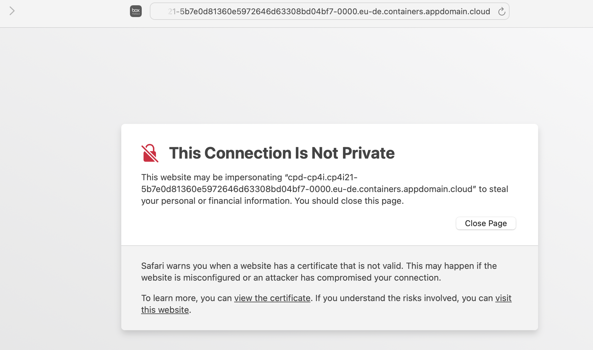

In this page, you can click on "visit this website".

---

### 1. Explore the User Interface

#### Logging in to IBM Event Streams UI

The _URL_ for Event Streams should have been provided seperately. Navigate to the user interface and you should be navigated automatically to the login page, if you didn't login previously.

> <font size="1">**[Event Streams URL]**</font>

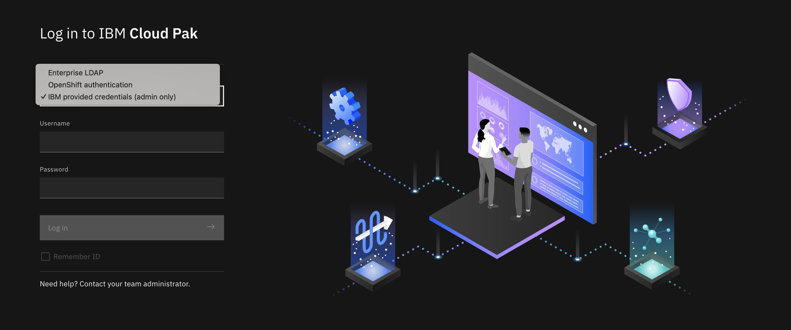

1. Select _IBM provided credentials_ and enter the provided _username & password_ and click Log in.

> <font size="1">**[Event Streams Username]**</font><br><font size="1">**[Event Streams Password]**</font>

You should now be logged in and see the _Welcome to Event Streams_ page. You are now ready to start the lab.

---

#### Explore Event Streams UI

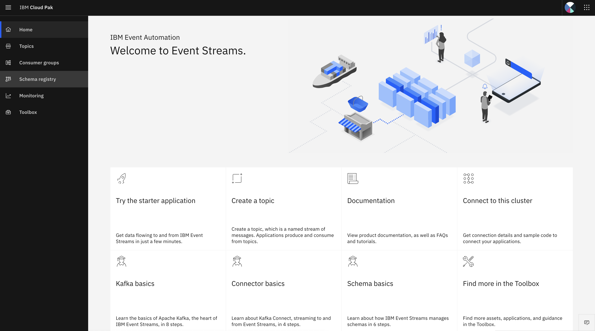

Welcome to **IBM Event Streams**. Let's explore the user interface.

On the home page, you will see some tiles that allow you to quickly navigate to the desired functionality or documentation.

Let's explore a couple of tiles:

- The **Try the starter application** will generate boilerplate Java code to quickly start using Event Streams. The project will contain a Kafka producer and consumer. It will also help you generate the credentials and properties files, required for the Java application to run properly.

- The **Documentation** tile will navigate you to the official documentation page of IBM Event Streams.

- **Connect to this cluster** will open a modal on the page, allowing you to quickly generate credentials, download necessary certificates and list the Kafka bootstrap URL and other information for connecting to the Kafka cluster.

- **Kafka basics, Connector basics & Schema basics** will give you a basic and quick introduction to Kafka. Each of those tiles will take you through a quick learning guide about the topic and give you a quickstart for understanding Kafka and Event Streams.

- **Find more in the Toolbox** will give you the tools for quickly start building Kafka applications. It will provide you boilerplate code to start interacting with your cluster, give you access to information about Kafka Connect and how to set up connectors.

In the upper-right corner, you will see a small round icon. If you click on this icon you can either navigate to your profile settings or log out.

On the left side of the screen you will see the navigation menu. By default the menu is collapsed, and you will only see icons. If you want to show the full menu with text, click on the arrow (**>**) in the bottom-left corner of the page.

1. click **Topics** in the menu.

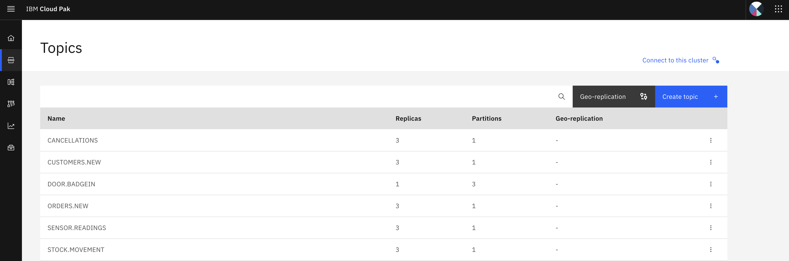

The **Topics** page allows you to manage your topics. Here, you will be able to create a topic, manage topics, view more details about a topic, find more information about how to connect to your cluster and topic, generate credentials for accessing the topic and set-up geo-replication. We will dive deeper on topics in a later stage.

2. click **Consumer groups** in the menu.

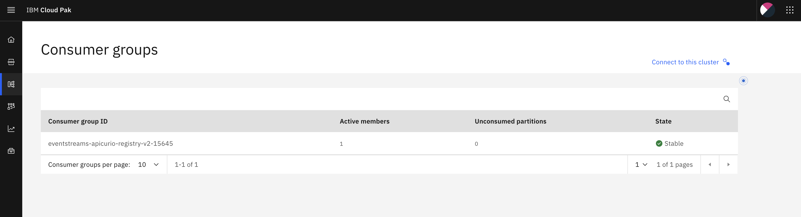

In the **Consumer groups** page you will see more information about your consumers groups, the amount of consumer groups accessing the cluster, active members, status and unconsumed partitions.

Click on a _Consumer group ID_. You should now see more information about the consumer group, like the Current offset, Log end offset and Offset lag. This can give you more insights in how the consumer group is behaving and detect issues early.

3. click **Schema Registry** in the menu.

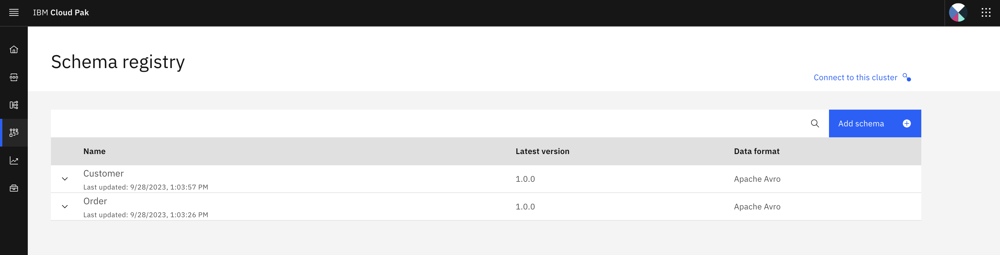

Apache Kafka can handle any data, but it does not validate the information in the messages. However, efficient handling of data often requires that it includes specific information in a certain format. Using schemas, you can define the structure of the data in a message, ensuring that both producers and consumers use the correct structure.

Schemas help producers create data that conforms to a predefined structure, defining the fields that need to be present together with the type of each field. This definition then helps consumers parse that data and interpret it correctly. Event Streams supports schemas and includes a schema registry for using and managing schemas.

It is common for all of the messages on a topic to use the same schema. The key and value of a message can each be described by a schema.

**Schema Registry**

Schemas are stored in internal Kafka topics by the Apicurio Registry, an open-source schema registry. In addition to storing a versioned history of schemas, Apicurio Registry provides an interface for retrieving them. Each Event Streams cluster has its own instance of Apicurio Registry providing schema registry functionality.

Your producers and consumers validate the data against the specified schema stored in the schema registry. This is in addition to going through Kafka brokers. The schemas do not need to be transferred in the messages this way, meaning the messages are smaller than without using a schema registry.

**Schemas**

Schemas are defined using [Apache Avro](https://avro.apache.org/), an open-source data serialization technology commonly used with Apache Kafka. It provides an efficient data encoding format, either by using the compact binary format or a more verbose, but human-readable JSON format.

The schema registry in Event Streams uses Apache Avro data formats. When messages are sent in the Avro format, they contain the data and the unique identifier for the schema used. The identifier specifies which schema in the registry is to be used for the message.

Avro has support for a wide range of data types, including primitive types (null, boolean, integer, long, float, double, bytes, and string) and complex types (record, enum, array, map, union, and fixed).

**Schema versioning**

Whenever you add a schema, and any subsequent versions of the same schema, Apicurio Registry validates the format automatically and warns of any issues. You can evolve your schemas over time to accommodate changing requirements. You simply create a new version of an existing schema, and the registry ensures that the new version is compatible with the existing version, meaning that producers and consumers using the existing version are not broken by the new version.

---

//TODO woudl not show that you can add if it is not part of the lab. Either upload already a schema such that they can see what it looks like and then provide some information or make a lab to add the schema

> Next, click _Add schema +_

Here you will be able to enter all the necessary information for adding a schema. You can upload the schema definition from a file and give your schema a relevant name and version.

> Next, click _Cancel_

On the **Schema Registry** page, you should see one or more schemas that where preconfigured for you. You should see the schema name, version and Data Format.

If you click on the arrow pointing down, you will see the whole schema definition in JSON format. If you click on the schema name, you will be navigated to the configuration page of that schema.

Here you can:

- Add a new Schema version
- Manage a schema version (deprecate, disable or remove)
- Configure message encoding (JSON, Binary)
- Find all the relevant information to connect to the schema registry, use the schema, generate credentials, etc...

> For more information on schemas and how to use them, navigate to: [Schemas overview](https://ibm.github.io/event-automation/es/schemas/overview/)

Let's have a view at the monitoring page.

---

4. click **Monitoring** in the menu

The Monitoring page allows you to quickly see important information about your Kafka cluster.

At the top, you can choose the timeframe of the data that is displayed (from 1 hour until 1 month). The data refreshes every 15 seconds.

You will see data about incoming and outgoing message size, partitions and replicas.

This data allows you to quickly monitor your cluster usage and detect problems with partitions and replicas.

5. click **Toolbox** in the menu

As discussed above, the toolbox will give you the tools for quickly start building Kafka applications and for interacting with your Kafka cluster.

---

### 2. Create a Kafka Topic

Now, we will create our own Kafka topic using the IBM Event Streams user interface. This topic will be used to produce and consume messages, generate access credentials and browse incoming messages

1. Select **Topics** from the menu

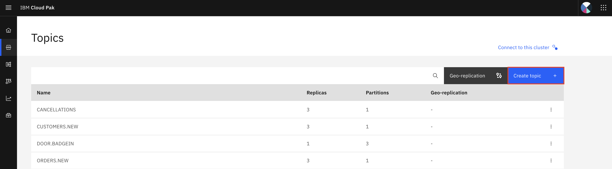

2. Select **Create Topic**

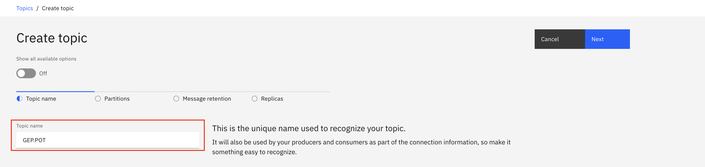

Choose a unique and recognizable topic name. For this lab, we'd recommend using your **initials** followed by a **.** and ending by **POT**.

For real use-cases, we would typically choose a relevant and meaningful topic name.

> e.g. If my name would be John Doe, I would call my topic: **JOD.POT**

3. Fill in your **Topic name**

4. click **Next**

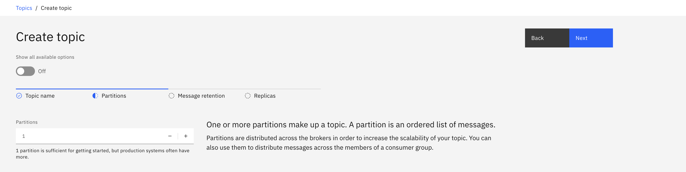

Here, you can choose the number of partitions for your topic.

> [!NOTE]  
> By having multiple partitions distributed across the brokers, the scalability of a topic is increased. If a topic has more than one partition, it allows data to be fed through in parallel to increase throughput by distributing the partitions across the cluster.

For the purpose of this lab, you can keep the default of **1 partition**.

5. Click **Next**

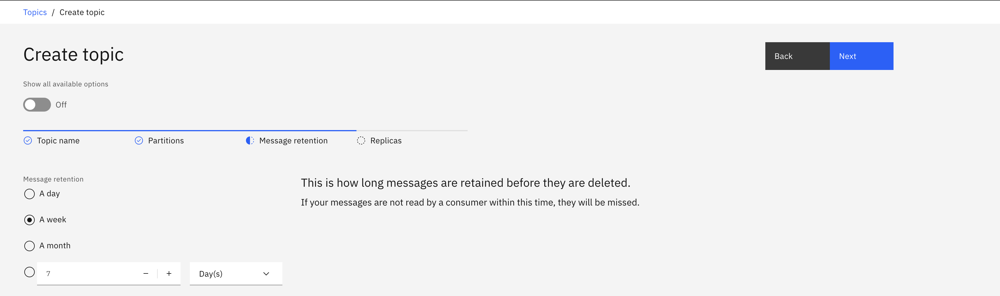

Now, you need to choose the retention period, meaning the amount of time the Kafka Cluster will keep your messages. After this period, messages will be deleted.

You can keep the default of **a week**.

6. Click **Next**

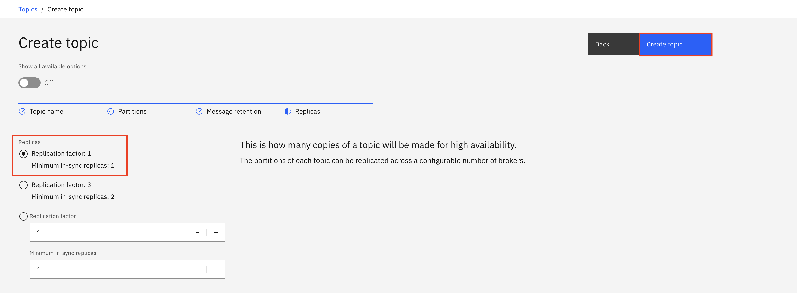

> [!NOTE]
> To improve availability and resiliency, each topic can be replicated onto multiple brokers. For each partition, one of the brokers is the leader, and the other brokers are the followers.

You can select **Replication factor: 1, Minimum in-sync replicas: 1** for the purpose of this lab.

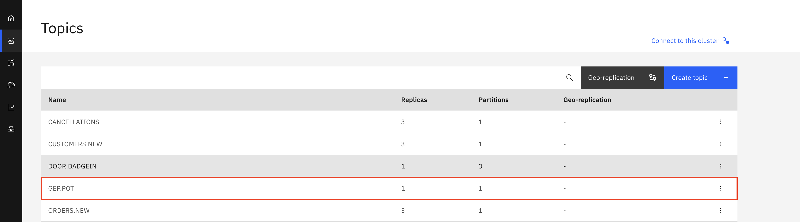

You will be navigated to the topics page, and hopefully your newly created topic will be displayed in the list of topics.

**Congratulations**! You have just created your first Kafka topic.

---

### 3. Generate SCRAM credentials

Now that we created our very first Kafka topic, let's move on and put our Kafka topic to use.  
The Kafka Cluster has been configured with security enabled, this is the recommended configuration for Kafka Cluster deployed in a production environnement.
With this type of configuration configured, the consumer application needs to authenticate against the Kafka cluster.  
EventStreams support the most used type of security configuration available for Kafka cluster which includes Mutual TLS, SCRAM-SHA-512, or OAuth authentication mechanisms.

For this lab, the EventStreams Kafka cluster has been configured with SCRAM and application connecting to the cluster will need to provide a user and password.

EventStreams is one of the solution based on Kafka that provides an easy to use user interface.  
You will discover in the lab how easy it is to create credentials to access a specific TOPIC using this user interface.

---

> [!NOTE]
>
> - Salted Challenge Response Authentication Mechanism (SCRAM) is a family of modern, password-based challenge–response authentication mechanisms providing authentication of a user to a server, used by many software like Kafka, MongoDB, database and etc.
> - An Event Streams cluster can be configured to expose any number of internal or external Kafka listeners. These listeners provide the mechanism for Kafka client applications to communicate with the Kafka brokers.
> - For more information on managing access, navigate to: [Managing Access](https://ibm.github.io/event-automation/es/security/managing-access/)

---

Let's now create the credentials for reaching our cluster securely.

From the **Topics** page, locate your previously created topic.

1. Navigate to **Topics** in the menu
2. click on your newly created **Topic** in the list of topics

3. Click on **Connect to this topic**

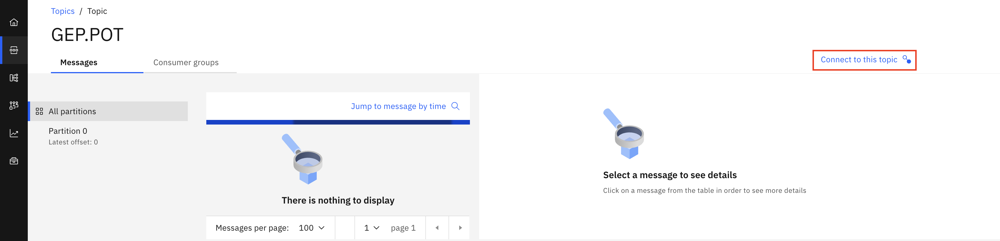

The topic connection information should now be displayed.  
The user interface allows us to easily create a Kafka user and generate SCRAM credentials.

4. Stick to **External** to use the external Kafka listener

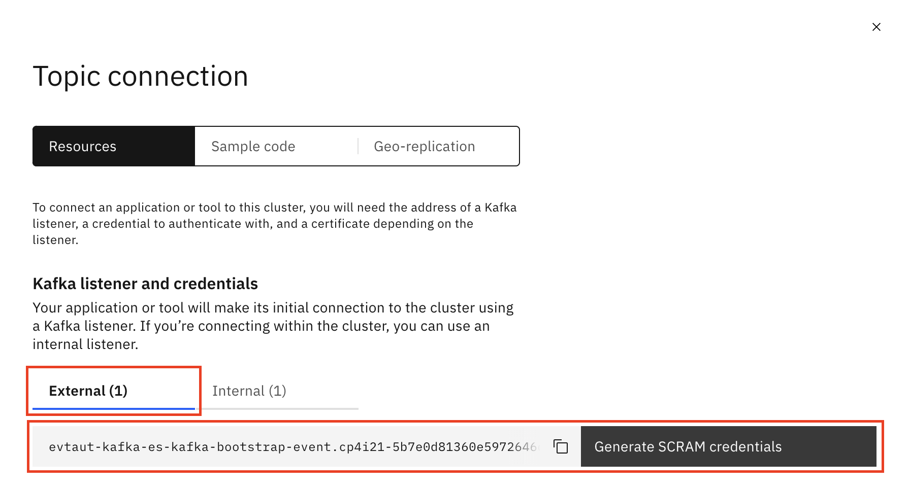

> EventStreams is configured with an external and internal listener.
>
> - Internal listener is used for application that are running within the same Kubernetes cluster. This listener is configured with mutual TLS to secure the connection.
> - External listener is used for application running outside of the cluster. This connection has been configured with SCRAM. As our producer and consumer application is running outside of the cluster we will use this connection.

5. click on **'Generate SCRAM credentials'**.

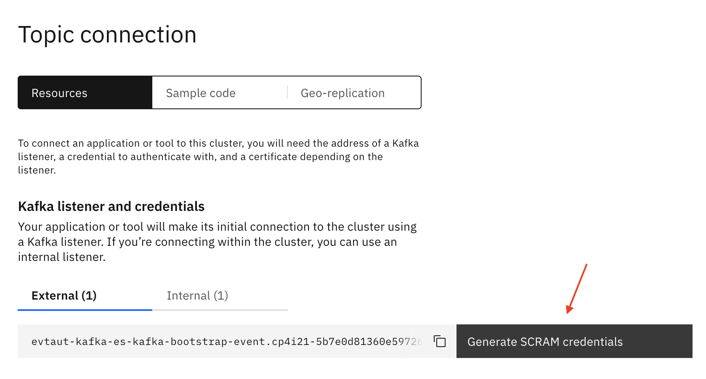

6. Provide credential name and select **'Produce and consume messages, and read schemas'**

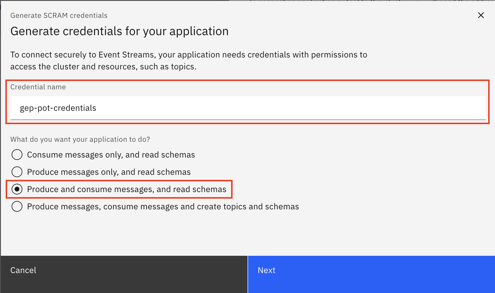

> [!IMPORTANT]
> Give your credentials a meaningful name. Use the pattern `<Initials>-pot-credentials`.  
> If my name would be John Doe, I would name my credentials: **jod-pot-credentials**.

We will use this credentials to produce and consume messages from the Kafka Topic.

7. click **'Next'**.

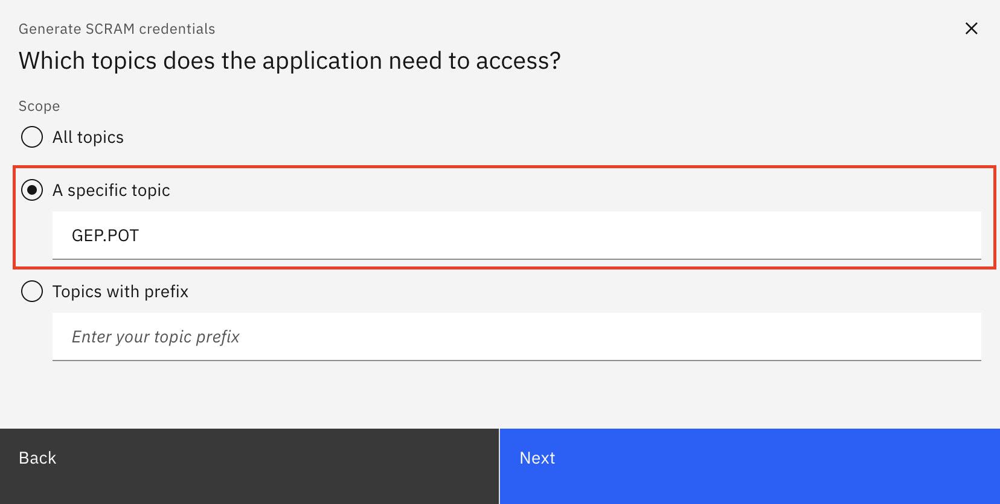

8. Select **'A specific topic'** and fill in your **previously created topic** name. Click **Next**.

This will allow us to create credentials that only have access to produce and consume messages to the topic we created earlier.

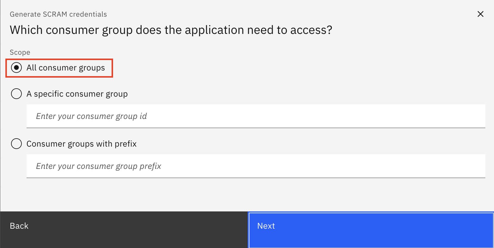

9. Keep the defaults **'All consumer groups'**. Click **'Next'**.

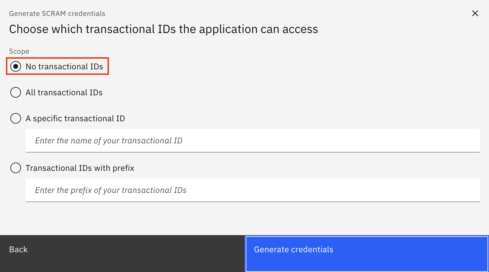

10. Keep the defaults **'No transactional IDs'**. Click **'Generate credentials'**.

The user interface provides a user and password that has been generated to access the TOPIC.

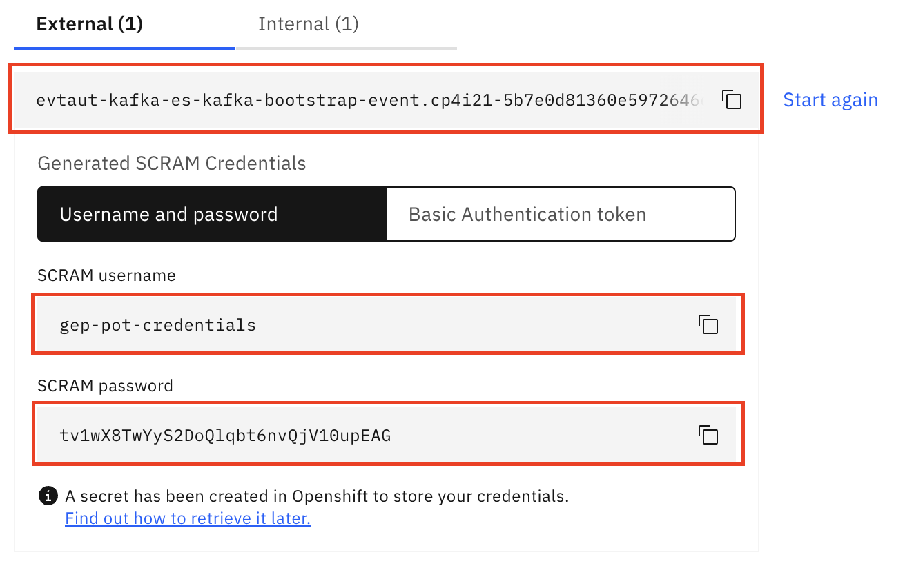

> [!WARNING]
> Copy the **Bootstrap URL**, **SCRAM username** and **SCRAM password** that have been generated, and keep them somewhere locally for later use (to produce and consume messages).

> [!NOTES]
> The bootstrap address is used for the initial connection to the cluster. The address will resolve to one of the brokers in the cluster and respond with metadata describing all the relevant connection information for the remaining brokers.

The SCRAM credentials have now been generated. We will now be able to securely connect to our Kafka cluster and produce and consume messages onto the topic we created.

> [!NOTES]
> Behind the scene, the EventStreams UI has generated KafkaUser object.

11. Click on **Download certificate** in the **PEM certificate** box

The PEM certificate is required by the Kafka application to trust the server that is connecting to and it will be used when we are going to consume messages.

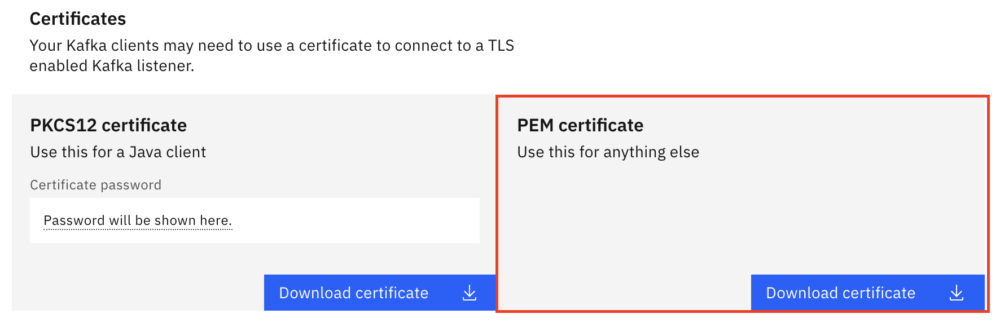

Now, let's move to the next section, where we will use these generated credentials to start producing messages.

---

### 4. Produce a message

To produce a Kafka message, an Kafka application producer would need to have

- the bootstrap URL: this is the Kafka server endpoint
- the topic: this is the place where the Kafka event will be sent
- Credentials: this is the user and password that the Kafka Server will use to authenticate and authorize the connection to the TOPIC.

In the previous section, we created SCRAM credentials with access rights to produce messages on our previously created topic.

To ease the Lab and to avoid installing software on the desktop, we have deployed a REST API EventStreams producer which allows to send messages to Kafka TOPIC using HTTP.
This RESP API has been exposed through [API Connect](https://www.ibm.com/products/api-connect) which secures the REST API and provides through its API developer portal an easy user interface to interact with a REST API.

> [!NOTE]  
> [API Connect](https://www.ibm.com/products/api-connect) is an API Management solution and is part of IBM's integration portfolio. With API Connect, we can manage the entire lifecycle of our API's. API Connect offers different tools to allow you to build, test and monitor your API's and securely expose them through our [API gateway](https://www.ibm.com/products/api-connect/api-gateway).
> More information on API Connect can be found at the [API Connect Documentation](https://www.ibm.com/docs/en/api-connect/10.0.5.x_lts).

---

#### Logging in to IBM API Connect and request access to producer API

The _URL_ for API Connect should have been provided separately.

1. Navigate to the API Connect Developer portal

Navigate to the developer portal and you should be navigated automatically to the login page, if you didn't login previously.
//TODO provide the URL

> <font size="1">**[API Connect URL]**</font>

2. Enter the provided _username & password_ and click **Sign in**.

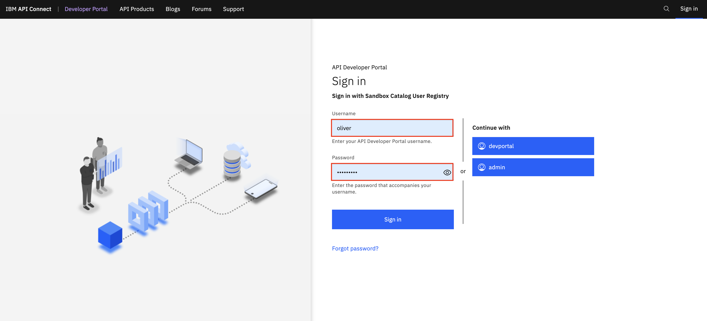

//TODO define the user/password pattern... potuser1 ?

> <font size="1">**[API Connect Username]**</font><br><font size="1">**[API Connect Password]**</font>

You should now be logged in and see the _API Connect Developer Portal_.

3. Select the **KafkaProducer** product.

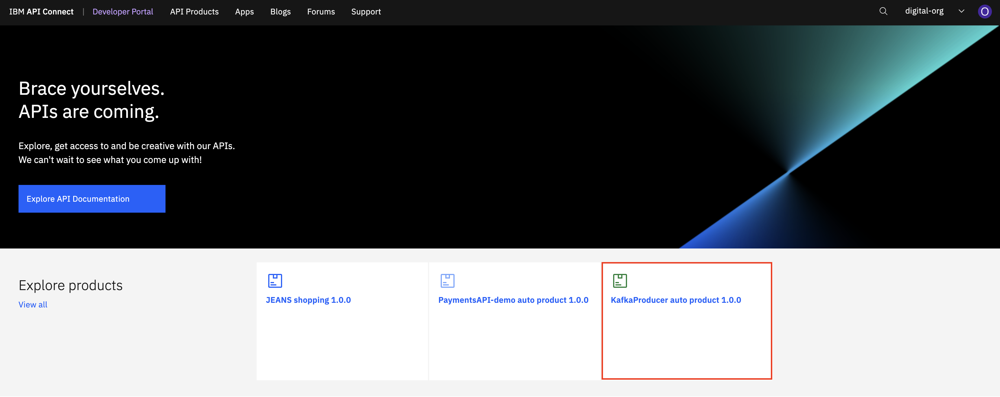

You should see one or more products on the developer portal dashboard after logging in.  
For this lab, we will use the **KafkaProducer product**, which contains the API we need for producing messages on a topic.  
If it is not listed in the product overview, click on the **API Products** in the menu at the top of the page.

4. Select the **KafkaProducer** API.

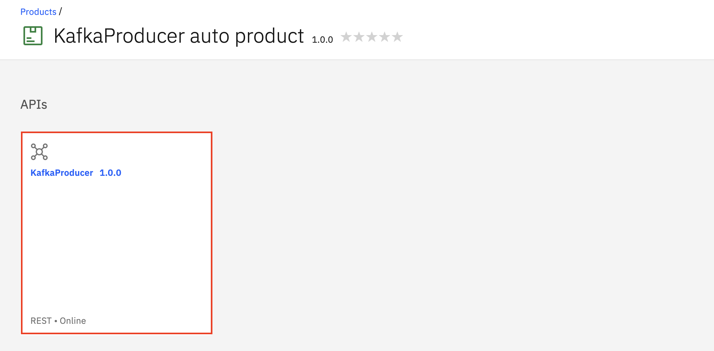

5. Select the **POST /jsonmessage/{topicName}** request on the left.

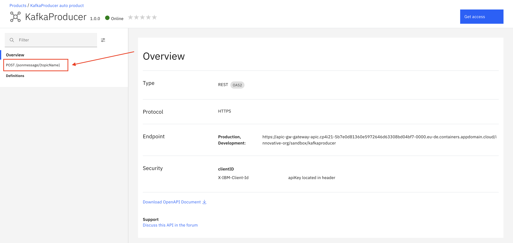

6. Click **Try it**.

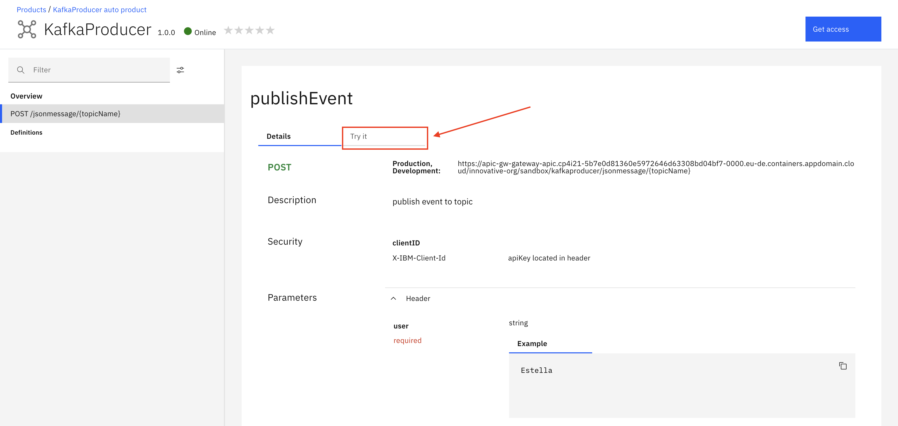

7. In the security Identification, check that the kafkaApp is selected

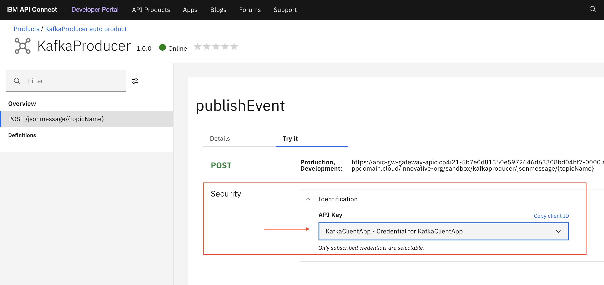

8. Fill the parameters

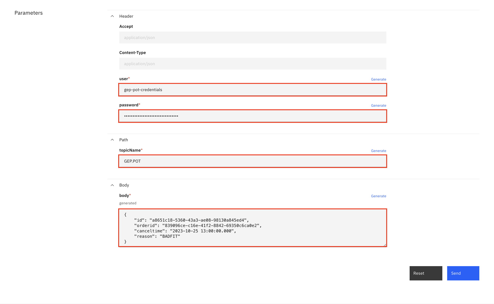

The last step to produce a message on our Kafka topic is to provide the Kafka user credentials, topic name and of course the message body.

In the previous section, you should have taken a copy of the Kafka credentials that you created, e.g. **jod-pot-credentials**.

Fill in

- **Kafka username**
- **Kafka password**
- **topic name**

Provide a sample **message body**, as an example you could use our sample message body:

```json
{
  "id": "a8651c18-5360-43a3-ae08-98130a845ed4",
  "orderid": "839096ce-c16e-41f2-8842-69350c6ca0e2",
  "canceltime": "2023-10-25 13:00:00.000",
  "reason": "BADFIT"
}
```

9. click **Send**.

If the message is successfully sent, you should receive a response with **status code 200**.  
You should also see the response message. The response contains relevant metadata of the message, like the timestamp, offset, partition and topic.

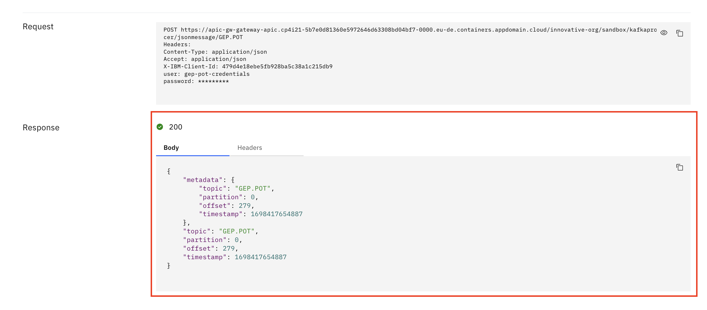

You can try to send a message to another TOPIC, you should receive an error. For example you can use the **CANCELLATIONS** TOPIC.
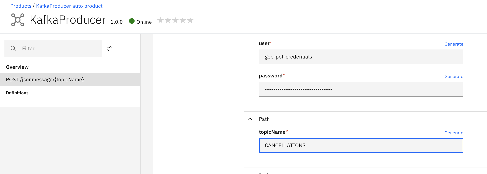

You should receive a unauthorized error:
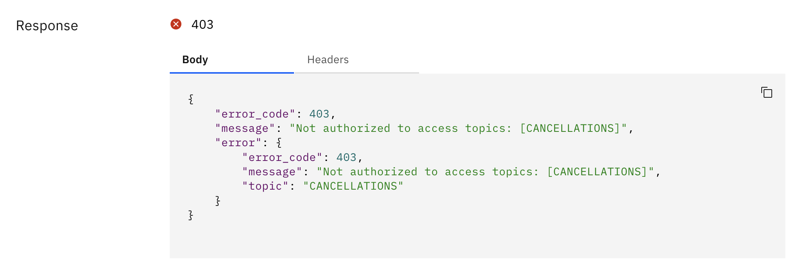

And if you try to send a message with a wrong user (for example remove credentials from the user name jod-pot instead of jod-pot-credentials), you should receive an authentication error:

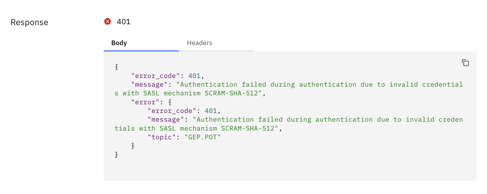

Congratulations! You have now officially produced a message on your Kafka topic.

Let's now explore how to browse our messages on a topic.

---

### 5. Browse TOPIC

In this section we will look at the events that you have generated using the producer API.
IBM EventStreams user interface provides the ability to browse the content of the TOPIC.

1. Open the **Event Streams** user interface

This is the user interface that we used to create our topic and make sure you are logged in.

> <font size="1">**[Event Streams URL]**</font>

2. Navigate to Topics, and locate your topic.

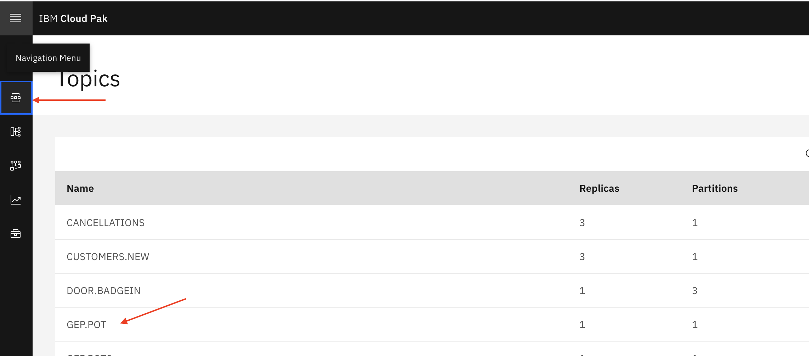

The messages that you have sent should be displayed:

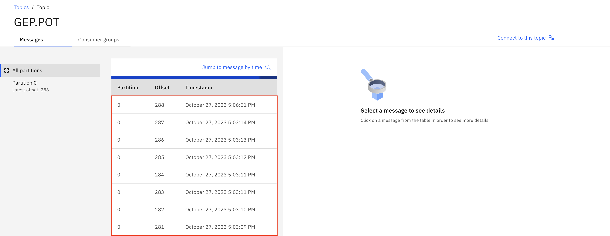

3. click on a specific message

From here, you can select a specific message, jump to messages by time and see some relevant fields like partition, offset and timestamp of the message.

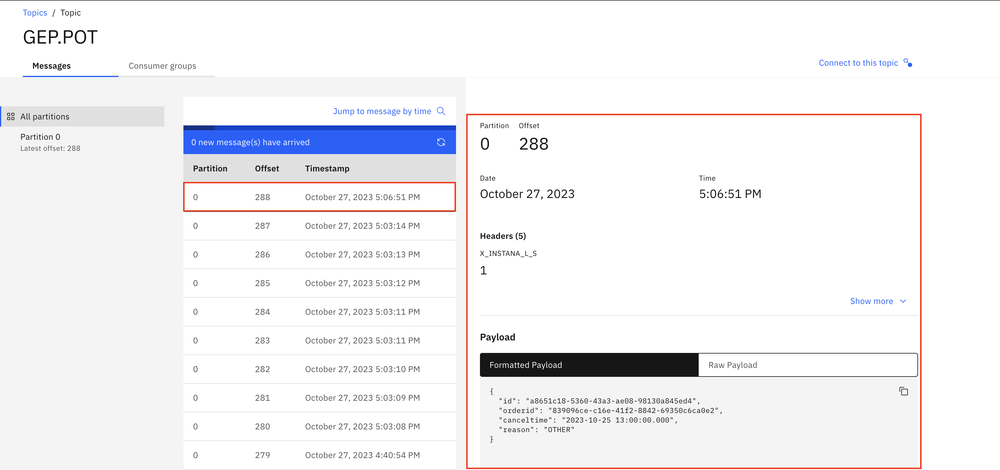

Here, you will find more information about the selected message in more detail. You will see the Partition, Offset, Date and Time as well as the Headers.

At the bottom, you will also see the message payload (formatted and raw).

### 6. Event Consumption

In this section we will explore how to consume events from a Kafka Topic.

Now that we have seen that your messages have been correctly sent on the TOPIC we will explore the consumption of them using a consumer application.

An application developer will create an application that will consume events from the TOPIC. This application will connect to the TOPIC using the Kafka protocol which will allow his application to consume existing events and to receive events as soon as they arrive on the TOPIC.

> [!NOTES]
> Unlike information that is made accessible to applications using a simple HTTP protocol, information received using the Kafka protocol allows consumer applications to receive events as soon as they are available in the topic. If they were using HTTP they would have to perform REST call at regular time interval.

> [!NOTES]
> The consumer application that we have provided for this PoT is composed by a front-end application that is providing a user interface and a back-end application that is connecting to a the Kafka Cluster using the Kafka protocol. The back-end server feeds the front-end application with the events that is receiving from Kafka using WebSocket. The WebSocket API is an advanced technology that makes it possible to open a two-way interactive communication session between the user's browser and a server. With this API, you can send messages to a server and receive event-driven responses without having to poll the server for a reply.

1. Navigate to the Kafka Demo App (consumer application front-end)

The _URL_ for the Kafka Demo App should have been provided separately.

> <font size="1">**[Kafka Demo App URL]**</font>

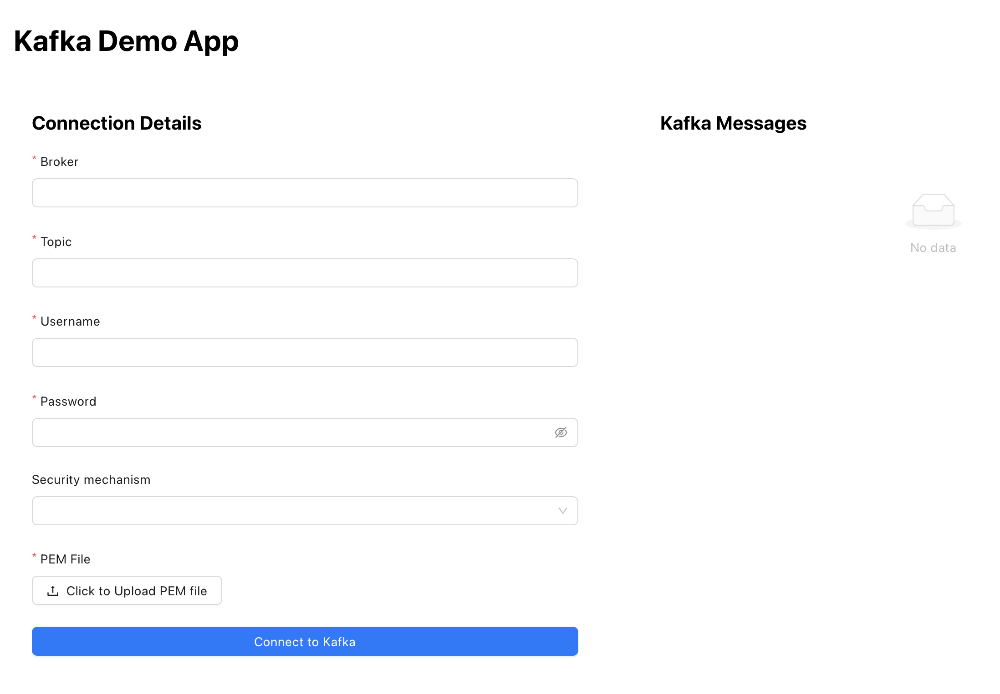

2. Fill in the required connection details

_Kafka Broker URL (Bootstrap URL)_, _Topic_, _Kafka username_ and _Kafka password_.

These connections information are those that you have saved in the Generate credentials section of this lab.
If you lost your credentials you can return to the lab and rerun the lab or call an assistant.

3. Select _SCRAM-SHA-512_ as the Security mechanism

4. Upload your previously downloaded _PEM certificate_.

Your application should looks like:

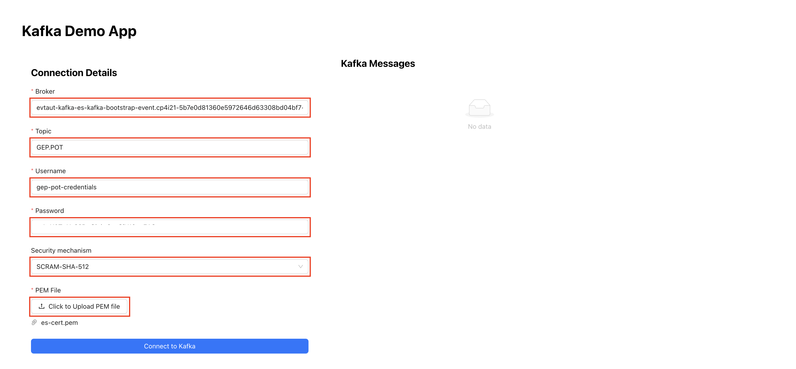

> <font size="1">**[Event Streams Broker]**</font><br><font size="1">**[Event Streams Topic]**</font><br><font size="1">**[Event Streams Password]**</font><br><font size="1">**[Event Streams Security Mechanism]**</font><br><font size="1">**[Event Streams PEM Certificate]**</font>

5. click **Connect to Kafka**.

If all goes well, you should now be able to see your previously produced message(s) on your topic.

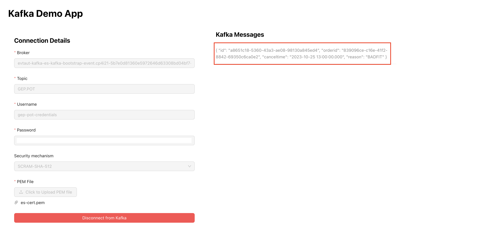

Feel free to produce a couple more messages using API Connect to see the messages being consumed in real-time!

6. Disconnect and re-connect Kafka

Disconnect the consumer application by clicking the **disconnect from Kafka** button and reconnect it by clicking back the **connect to Kafka** button.

You will realized that the application is not reading any messages. Why?

> [!NOTES]
> One of the value of Kafka is that messages written to a TOPIC are retained for a specific amount of time (defined at the TOPIC creation) and can't be modified.  
> This has two advantages:
>
> - a consumer application is able to replay all messages in the TOPIC. By default Kafka keeps the last message position (offset) of the application consumer. If the consumer application disconnect and reconnect, Kafka will reposition the cursor of the application consumer where it was before the disconnection. This is the normal behavior of a Kafka consumer and **this is what we have implemented for the provided consumer application** . It is possible to force the consumer application to restart from the beginning though, this can be useful for specific use cases such as
>   - an application crashes and you need to replay the log to build a state
>   - fine tuning an AI model that needs to replay all the events with a modified model
> - a new consumer application will be able to consume all the messages that have been put in the TOPIC. This is not possible with a queueing messaging solution where the messages are removed if the message has been consumer by an application.

---

##### OPTIONAL. Connect using another TOPIC

As you have generate credentials to consume event from a specific topic, you should not be able to access another topic.  
You can test to connect to another existing TOPIC with the same credentials, for example the **CANCELLATIONS** TOPIC.
You should receive an authorization error.

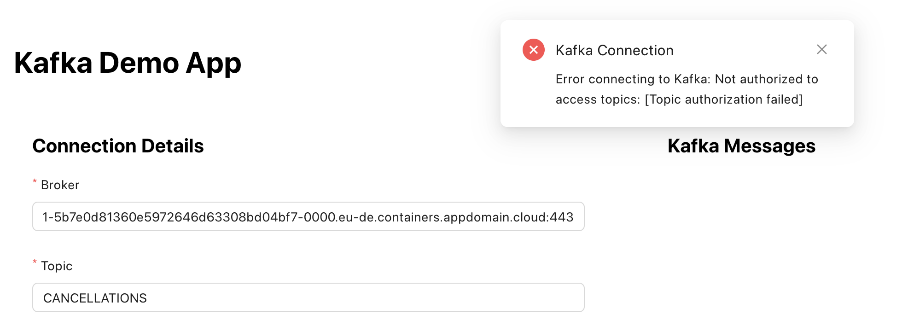

---

> [!IMPORTANT]
> Reconnect your application with your TOPIC to EventStreams, we will use this connection on the last part of the lab.

### 7. Consumer monitoring

In this part we will briefly look at the connection that you have made with your consumer application.  
Your consumer application should still be connected to EventStreams.

1. Open the **Event Streams** user interface

This is the user interface that we used to create our topic and make sure you are logged in.

> <font size="1">**[Event Streams URL]**</font>

2. Navigate to Topics, and locate your topic.


3. Select the consumer group

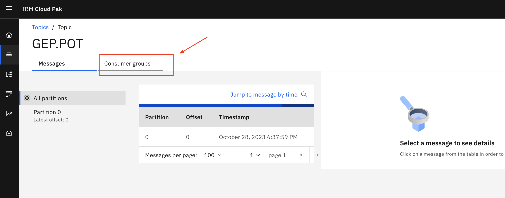

The page display the different consumer that has been connected and those that are connected.
In your case, you should have only one consumer. In the picture below, we have made multiple tests and you can see multiple subscription.

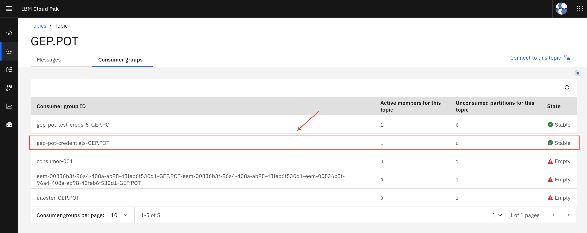

You subscription should be listed with a group Id following the pattern - `<username>-<topic>` and it should be reported as stable.

The consumer application is configured with

- ClientId: "demoConsumerApp"
- UserName: this is the user provided through the user interface
- GroupId: `<username>-<topic>``

4. Select the consumer group in the list

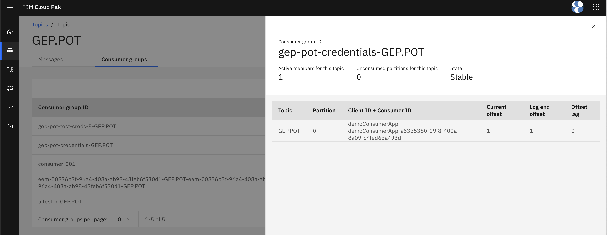

The interface give you useful information about the consumer.

- ClientID that should be "demoConsumerApp" (provided by the consumer application)
- ConsumerID generated by the Kafka Cluster.
- Current offset: the offset that the application is currently using in the partition.
- Offset lag: this value is usually 0. If the consumer application is not able to consume the messages quickly enough, this value will provide how far the application is behind the last event in the TOPIC. This can be due to a bad network or if your application is not performant enough to consume events.

---

#### Recap

In this lab, we used Event Streams as our Kafka broker. We explored the user interface, created a Kafka topic and credentials and showed you how to explore Kafka messages through the user interface. We also tested the producing capabilities through API Connect and displayed the messages in real-time by connecting with the Demo Kafka App.
