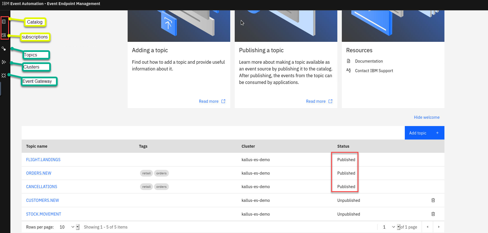

# LAB 02 - Event Endpoint Management

**Event Endpoint Management** provides the capability to describe and catalog your Kafka topics as event sources, and to share the details of the topics with application developers within the organization. Application developers can discover the event source and configure their applications to subscribe to the stream of events, providing self-service access to the message content from the event stream.


EEM provides a User Interface to author the event source, which are TOPIC defined on a Kafka cluster, that will be made available for the application developer.
When an event source is published by the EEM author user, the event source is made available on the EEM catalog portal and configured on the event gateway.

Access to the event sources are managed by the Event Gateway. The Event Gateway handles the incoming requests from applications to consume from a topic’s stream of events. 
The Event Gateway is independent of your Kafka clusters, making access control to topics possible **without requiring any changes** to your Kafka cluster configuration.


In this lab you will discover the main capabilities provided by the Event Endpoint Management. 
- Part 1 - TOPIC Authoring: you will start as an EEM administrator and you will describe the topic that you created in the event streams lab and you will publish it to make it available to consumers. 
- Part 2 - Event Consumption: once the topic has been described and published, as an application developer, you will access the catalog to discover what event source are made available and you will subscribe to an event source.
- Part 2 - Event Management: Finally as an EEM administrator you will review the subscription and revoke the access.

// TODO: check the following
We are also providing an optional lab that explain how API Connect, our API Management solution, integrates with our Event Endpoint Management solution.
In this lab you will see how EEM can leverage the API Connect developer portal to provide a much more richer consumer experience.

## Part 1 - TOPIC Authoring

In this part, you will describe the Topic that has been created in the Event Streams Lab1 and publish it to make it available to the application developer in the EEM catalog.

To achieve those task you will need to login in EEM as an author user.

1. Login to the EEM home page as **eem-admin**
// TODO: creds made available in another way ?
- eem_url: https://evtaut-eem-ibm-eem-manager-event.cp4i21-5b7e0d81360e5972646d63308bd04bf7-0000.eu-de.containers.appdomain.cloud
- eem_user: "eem_admin"
- eem_pwd: "********"


2. Got to the Topic section on the UI


This section allows the user to describe the Topic that are available on a Kafka cluster.
The connection configuration to the EventStreams Kafka cluster has already been configured in EEM.

You will describe the Topic that you have configured in the first lab in EventStream, in my case, the TOPIC was "PR.TEST".

In the following figure we can see that the TOPIC "PR.TEST" has been created in EventStreams:


3. Click on the "Add topic" button
4. In the cluster selection click the event stream kafka cluster [clusterName] and click the button "Next" // TODO: add the cluster name  
5. Select the TOPIC that you have created
EEM has connected to the Kafka cluster and provide you the list of Kafka TOPIC that are available on the cluster.
Select the topic that you created in the event streams lab. In my case it is the "PR.TEST" topic as you can see in the following figure:


You have the possibility to change the Topic name that will be displayed to the application developer. For this lab, we will keep it as is. 

6. click on the "Add topic" button

7. Click on the "topic" that you created in the EEM topic section


8. Click on the "Edit Information" button


The event source information that we will provide corresponds to the **new customer** event that we have used in the event streams lab. 

**Overview Information**

Provide a topic description such as for example: 
```
New customer registrations from the customer management system.
```
You can also provide a tag to group related event. Provide as tag "retail"


**Event Information**

Download the new customer avro schema available at the following link: 
[newcustomer](resources/assets/new_customer.avsc).
Upload the schema by selecting the downloaded schema.
The schema should be uploaded and validated correctly:


It is also possible to provide a message example in the sample.
You can add the sample by copying/pasting the following message:
```json
{    "customerid": "f727464e",    
"customername": "Connie Upton",    
"registered": "2023-05-25 22:38:29.453"}
```


9. Click Save

We are now ready to publish the topic that we have described.

10. Click the Manage tab


11. Click the "publish" button


12. Select the "gateway-group" and click on the button "Publish topic"


A message information should be displayed telling that the topic has been published.
The topic is now published on the EEM catalog and is made available for application developer.
The event gateway has been configured to allow connection to this TOPIC (connection to other topics that have not been configured on the gateway is not allowed) and only to **consume** event (event publication is not allowed). 
Credentials needs to be provided in order to consume event through the gateway. These credentials will be generated when the application developer self-register to consume events from this topic in the catalog.
This will be done on the next part of the lab.

> The event gateway expose a topic to a consumer that is using **Kafka as protocol**.  

### Wrap-up
In this part we have 
- connected to a Kafka Cluster (here the one provided by EventStreams) and select the Topic that we would like to make available to the application developer through the EEM catalog and the event gateway.
- Provided information about the topic and the message structure of the event
- Published the Topic on the catalog and the event gateway

> You have finished this part of the lab you can proceed to the next one.

## Part 2 - Event Consumption

### Introduction

In this part you will play the role of an application developer that would like to consume an event made available.
You will browse the event source in a catalog and will subscribe to the topic to which you would like to consume event.

> The event source is available for consumption using a Kafka Client

> The **catalog** lists all available topics that represent event sources. Kafka administrators can check what topics are published and made available to others in the organization. Application developers in your organization can use the catalog to browse the available topics, and to view more information about each of them, including a description, tags, sample messages, schema details if used, and so on, enabling self-service access to the stream of events represented by the topics.

If you would like to test the consumption of the event, it is possible to use the starter application provided in the EventStreams toolbox. The starter application require to have java installed. Please refer to the appendix "install java". //TODO is it documented ?

> Note that you could use any Kafka client 

### Labs 

1. Login in EEM using the user **EEM-user** 

We will use the user **EEM-user** to experience the application developer view: the application developer is authorized to only access the catalog.

Logout if not already done, by clicking on the user icon on the top right corner: 


Login using the following credentials:
- eem_user: "eem-user"
- eem_pwd: "****"

2. Select the catalog view 

On the catalog view, you can see all the available event source (Topic) that have been published.

> Advanced capabilities in term of who can see what event sources and group event sources under a specific product are provided by the API Connect Developer portal.

The API Connect developer portal can be integrated with EEM. If you would like to have more information on that details, please look at the lab ***** //TODO: provide the link to the lab

3. Click on the TOPIC 

Click on the TOPIC that you documented on the previous section of this lab.
Here the "PR.TEST" has been selected.


You can review information about the topic: what is the schema associated to the event and you can click on message sample to get an example of message.

The application developer can here copy the Kafka endpoint to be used by the Kafka client application. 
The endpoint ca certificate can be downloaded to allow clients to be configured with the expected client certificate to trust.


Note that the Kafka endpoint provided here is the **gateway endpoint** and not the EventStreams kafka endpoint.
The application developer will use this endpoint and the kafka cluster is hidden behind the gateway.

4. click on "Generate access credentials"


This will generate the required credentials for the Kafka client application. 


Here you will need to provide the details of the contact.
> This information can be used later by the event provider team to easily contact the application developer.
The event provider team can browse the different subscription for a Topic and see who to contact.

5. Click "generate"


The credential generated is a SASL username and password, which uniquely identifies you and your usage of this event source (topic). These credentials must be used when accessing the event source through the Event Gateway.

> [!NOTE]  
> The current supported authentication with the gateway is PLAIN SASL_SSL. 


The EEM administrator will manage the **Topics, Clusters, and Event gateways**
Also will published the topics that will be visible to developers 

// TODO: explain the different user role  
    



Catalog

The catalog lists all available topics that represent event sources. Kafka administrators can check what topics are published and made available to others in the organization. Application developers in your organization can use the catalog to browse the available topics, and to view more information about each of them, including a description, tags, sample messages, schema details if used, and so on, enabling self-service access to the stream of events represented by the topics.

Cluster

Kafka runs as a cluster of one or more servers (Kafka brokers). The load is balanced across the cluster by distributing it amongst the servers.

Event Gateway

Access to the event sources are managed by the Event Gateway. The Event Gateway handles the incoming requests from applications to consume from a topic’s stream of events, routing traffic securely between the Kafka cluster and the application.

The Event Gateway is independent of your Kafka clusters, making access control to topics possible without requiring any changes to your Kafka cluster configuration.

Subscription

Application developers configure their applications to subscribe to the stream of events, providing self-service access to the message content from the event stream, and generating the required credentials for their application to consume from the topic. Kafka administrators can manage subscriptions that are created for their topics in the Event Endpoint Management Topic Detail page.


## TOPIC registration

# LAB 02.1 - Event Endpoint Management with API Connect

