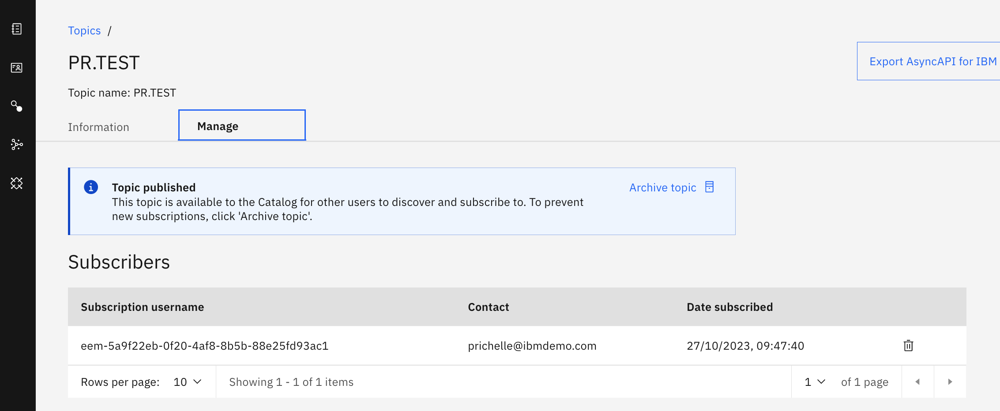
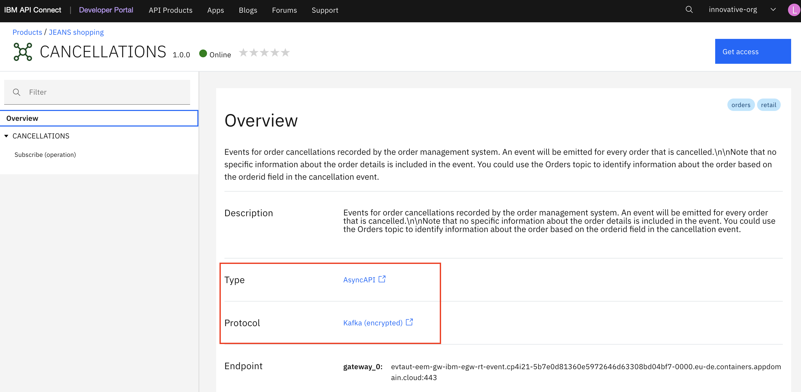

# LAB 02 - Event Endpoint Management

**Event Endpoint Management** provides the capability to describe and catalog your Kafka topics as event sources, and to share the details of the topics with application developers within the organization. Application developers can discover the event source and configure their applications to subscribe to the stream of events, providing self-service access to the message content from the event stream.


EEM provides a User Interface to author the event source, which are TOPIC defined on a Kafka cluster, that will be made available for the application developer.
When an event source is published by the EEM author user, the event source is made available on the EEM catalog portal and configured on the event gateway.

Access to the event sources are managed by the Event Gateway. The Event Gateway handles the incoming requests from applications to consume from a topic’s stream of events. 
The Event Gateway is independent of your Kafka clusters, making access control to topics possible **without requiring any changes** to your Kafka cluster configuration.


In this lab you will discover the main capabilities provided by the Event Endpoint Management. 
- Part 1 - TOPIC Authoring: you will start as an EEM administrator and you will describe the topic that you created in the event streams lab and you will publish it to make it available to consumers. 
- Part 2 - Event Consumption: once the topic has been described and published, as an application developer, you will access the catalog to discover what event source are made available and you will subscribe to an event source.
- Part 3 - Event Management: Finally as an EEM administrator you will review the subscription and revoke the access.

We are also providing an optional lab that explain how API Connect, our API Management solution, integrates with our Event Endpoint Management solution.
In this lab you will see how EEM can leverage the API Connect developer portal to provide a much more richer consumer experience.

> [!IMPORTANT]  
> if you have an unauthorized message, this can be due to the fact that you have been signed out after a non activity on the UI. Please refresh the UI and re-authenticate.

## Part 1 - TOPIC Authoring

In this part, you will describe the Topic that has been created in the Event Streams Lab1 and publish it to make it available to the application developer in the EEM catalog.

To achieve those task you will need to login in EEM as an author user.

1. Login to the EEM home page as **eem-admin**


- eem_url: [Event Endpoint Management](https://my-eem-manager-ibm-eem-manager-event-automation.apps.melch.coc-ibm.com/)
- eem_user: "eem-admin"
- eem_pwd: the password would be provided by the assistant

  

2. Got to the Topic section on the UI


This section allows the user to describe the Topic that are available on a Kafka cluster.
The connection configuration to the EventStreams Kafka cluster has already been configured in EEM.

You will describe the **Topic that you have configured in the first lab in EventStream**. 

> [!WARNING]  
> Note that for this PoT we had recommended using your initials followed by a . and ending by POT. Like "PR.POT".

The TOPIC name used to illustrate this lab is "PR.TEST", however.

In the following figure we can see that the TOPIC "PR.TEST" was created in **EventStreams**.  
 

3. Click on the "Add topic" button in the Event Endpoint Management Topic section


4. In the cluster selection click the event stream kafka cluster [clusterName] and click the button "Next".


5. Select the TOPIC that you have created 
 
EEM is connecting to the Kafka cluster and provides you the list of Kafka TOPIC that are available on the cluster.
Select the topic that you created in the event streams lab. 
In my case it is the "PR.TEST" topic as you can see in the following figure:  

 

You have the possibility to change the Topic name that will be displayed to the application developer. For this lab, we will keep it as is. 
6. click on the "Add topic" button after that you selected the topic that you want to add.

7. Click on the "topic" that you created in the EEM topic section


8. Click on the "Edit Information" button


  The event source information that we will provide corresponds to the **new customer** event that we have used in the event streams lab. 

  - **Overview Information**

  Provide a topic description such as for example: `New customer registrations from the customer management system.`  
  You can also provide a tag to group related event. Provide as tag "retail"


- **Event Information**

Download the new customer avro schema available at the following link:  
[newcustomer](resources/assets/new_customer.avsc).  

Upload the schema by selecting the downloaded schema.  
The schema should be uploaded and validated correctly:  


It is also possible to provide a message example in the sample.  
You can add the sample by copying/pasting the following message:
```json
{
  "customerid": "f727464e",
  "customername": "Connie Upton",
  "registered": "2023-05-25 22:38:29.453"
  }
```


9. Click Save

We are now ready to publish the topic that we have described.

10. Click the Manage tab


11. Click the "publish" button


12. Select the "gateway-group" and click on the button "Publish topic"
  


A message information should be displayed telling that the topic has been published.  
The topic is now published on the EEM catalog and is made available for application developer.  
The event gateway has been configured to allow connection to this TOPIC (connection to other topics that have not been configured on the gateway is not allowed) and only to **consume** event (event publication is not allowed).  
Credentials needs to be provided in order to consume event through the gateway. These credentials will be generated when the application developer self-register to consume events from this topic in the catalog.   
This will be done on the next part of the lab.

> The event gateway exposes a topic to a consumer that is using **Kafka as protocol**.  

### Wrap-up  

In this part we have 
- connected to a Kafka Cluster (here the one provided by EventStreams) and select the Topic that we would like to make available to the application developer through the EEM catalog and the event gateway.
- Provided information about the topic and the message structure of the event
- Published the Topic on the catalog and the event gateway

> You have finished this part of the lab you can proceed to the next one.

## Part 2 - Event Consumption

### Introduction

In this part you will play the role of an application developer that would like to consume an event made available.
You will browse the event source in a catalog and will subscribe to the topic to which you would like to consume event.

> The event source is available for consumption using a Kafka Client

> The **catalog** lists all available topics that represent event sources. Kafka administrators can check what topics are published and made available to others in the organization. Application developers in your organization can use the catalog to browse the available topics, and to view more information about each of them, including a description, tags, sample messages, schema details if used, and so on, enabling self-service access to the stream of events represented by the topics.


### Create Subscription lab

1. Login in EEM using the user **es-user** 

We will use the user **es-user** to experience the application developer view: the application developer is authorized to only access the catalog.

Logout if not already done, by clicking on the user icon on the top right corner: 


Login using the following credentials:
- eem_user: **es-user**
- eem_pwd: is provided by the assistant

2. Select the catalog view  


On the catalog view, you can see all the available event source (Topic) that have been published.

> The API Connect Developer portal provides advanced capabilities in term of who can see what event sources and it also allows to group event sources (the group is called a product).

3. Click on the TOPIC 

Click on the TOPIC that you documented on the previous section of this lab.
Here the "PR.TEST" has been selected.


You can review information about the topic: what is the schema associated to the event and you can click on message sample to get an example of message.

4. Copy the Gateway Endpoint

The application developer can here copy the Kafka endpoint to be used by the Kafka client application. 
The endpoint ca certificate can be downloaded to allow clients to be configured with the expected client certificate to trust.


Note that the Kafka endpoint provided here is the **gateway endpoint** and not the EventStreams kafka endpoint.  
The application developer will use this endpoint and the kafka cluster is hidden behind the gateway.

>[!IMPORTANT]  
>Copy the gateway endpoint.  
>Download the certificate.   
>They will be used at a later stage when we will test the consumption of the events.

5. click on "Generate access credentials"


This will generate the required credentials for the Kafka client application.


Here you will need to provide the details of the contact.
> This information can be used later by the event provider team to easily contact the application developer.
The event provider team can browse the different subscription for a Topic and see who to contact.

6. Click "generate"


The credential generated is a SASL username and password, which uniquely identifies you and your usage of this event source (topic). These credentials must be used when accessing the event source through the Event Gateway. The Event Gateway is using it's own credentials to access the Kafka Cluster and it has already been configured for you.


> [!NOTE]   
> The current supported authentication with the gateway is PLAIN SASL_SSL.
>
> PLAIN relies on a combination of username and password to log in over a TLS connection, meaning that your traffic is encrypted.
>
> Simple Authentication and Security Layer (SASL) 


7. Save the credentials

> [!WARNING]  
> Copy the username and password here. The password can't be retrieved once the window is closed. You can choose to download the credentials as JSON for reuse.

You can now close the window.

8. Select subscription

Navigate to the subscription tab


On this page you can see all the subscription that has been made by the application developer user (the user used to authenticate on the UI).


> [!NOTE]  
> You have also the option here to delete a subscription if it is no more required.

> [!IMPORTANT]  
> A subscription that is removed can't be restored. Once the subscription has been deleted the application using those credentials will not be able to consume event from TOPIC.

### Event consumption with consumer application

This part demonstrate how to consume event from the TOPIC using the information provided by the Event Endpoint Management.  
The Kafka client application will consume the messages through the EEM Event Gateway.

In order to consume an event from Kafka you will need the following information that you have already gathered in the previous part:  

- **Broker**: this corresponds to the Kafka Endpoint which in this case is the **event gateway endpoint**. It can be retrieved on the TOPIC description in the EEM catalog section.


- **certificate**: this is the certificate that Kafka needs to trust the endpoint that you are going to connect to. It can be retrieved on the TOPIC description in the EEM catalog section. Just on th right side of the event gateway endpoint (see Broker above).

- **TOPIC**: this corresponds to the topic that you have subscribed to in the previous section using the EEM catalog.
- **user**: this value has been generated when you subscribed to the TOPIC on the EEM UI.
- **password**: this value has been generated when you subscribed to the TOPIC on the EEM UI.
- **Security Mechanism**: The gateway is currently only supporting the security PLAIN 

We have provided a user interface to consume events from a Kafka topic. The user interface is using WebSocket to receive update from the backend server that is connected to Kafka using Kafka protocol.

9. Access the consumer tool that we have provided for this PoT at the following URL:  

[Kafka Demo App URL](http://kafka-consumer-app.apps.melch.coc-ibm.com/)


10. Provide the required parameters using the information that you retrieved from the Event Endpoint Management UI See [Topic Authoring](#Part 1 - TOPIC Authoring).   


- Broker (servers from EEM)
- TOPIC: name of the TOPIC
- user, password
- **security mechanism "PLAIN"** 
- certificate


11. Click the button "Connect to Kafka"

You should not see any error and your client application is now listening for events on the selected TOPIC.


You should see messages coming on the right side:


The first time that the consumer application is started, the application will consume all the messages from the beginning of the TOPIC.

---
> [!NOTES]
> Some information on the consumer group Id

The gateway is connecting to the Kafka broker using a new group id using the following pattern: `<ClientId>-<UserName>-<GroupId>`.  
The ClientId, UserName and GroupId is the value provided by the KafkaClient.   
The consumer application is configured with 
- ClientId: "demoConsumerApp"
- UserName: this is the user provided through the user interface
- GroupId: `<username>-<topic>`

If you navigate to the event streams UI, select the topic and then look at the consumer groups you will see your groupId for the application consumer


This approach provide a security protection by avoiding that an external application joins an existing group and interferes with the application currently consuming the events.

---

You can send new messages by taking back the rest API provided through API Connect.

>1. Login into the [API Connect Developer Portal](https://apim-demo-ptl-portal-web-cp4i-apic.apps.melch.coc-ibm.com/melch-admin-porg/sandbox) 
>2. Select the **Kafka Utils** product an then the **kafkaProducer** API
>3. Select POST jsonmessage request
>4. select tryit
>5. add a message and send

12. Change the TOPIC name   

Try to consume messages from another TOPIC available in EventStreams through the event gateway using the same credentials.  
    - Disconnect to Kafka
    - Change the TOPIC name to **CANCELLATIONS**
    - Click on the button **connect to kafka**
The consumer application is throwing an connection error to Kafka:


The credential that you have received only allows to connect to the TOPIC to witch you have subscribed.

13. Change the credentials


### Wrap-up

This conclude the lab of this part.

> [!NOTE]  
> Keep your application consumer open you will need it in the next part.

In this part you have used the Catalog section of the EEM UI to select the TOPIC that you would like to consume event from.  
You have reviewed the information related to your TOPIC.  
You have subscribe to the TOPIC and received the required credentials to be able to consume events from the TOPIC.

With the consumer application you consumed events from the TOPIC configured on the Event Streams Kafka Broker via the Event gateway.

## Part 3 - Event Management

In this last part of the event endpoint management, you take the role of the EEM admin and we will explore the life cycle of a TOPIC and how to revoke access of a consumer.

### TOPIC LifeCycle

The life cycle overview of a TOPIC is provided at the following picture:


The topic has three states:
- Unpublished: the topic has never been made visible in the catalog and published to the event gateway.  
- Published: the topic is visible in the catalog and configured on the gateway. Application developer can subscribe to the topic to consume events.  
- Archived: the topic is either visible in the catalog if there were subscription attached to it, or not visible in the catalog. In the archive stated, if the TOPIC is visible in the catalog, it is not possible for the application developer to subscribe to it.

### Archive the TOPIC

1. Login to the EEM home page as **eem-admin**


  

- eem_url: [Event Endpoint Management](https://my-eem-manager-ibm-eem-manager-event-automation.apps.melch.coc-ibm.com/)
- eem_user: "eem-admin"
- eem_pwd: the password would be provided by the assistant


2. Click on TOPIC  
   
  

3. Select your TOPIC
4. Click on "Manage"
   


In the subscribers section, you can see all the subscription for this specific TOPIC.
The application developer contact information is available here.

5. Click "Archive Topic"


As you still have your subscription attached to the topic, the TOPIC is now in the state **Archived**.


It is still visible in the catalog but new application developers are not allowed to subscribe.

6. Navigate to the "Catalog" section and select your TOPIC
   


7. Open your consumer application  
   
You can validate that existing application can still consume events from the topic, disconnect and reconnect to the topic.  
You can test by sending events to the topic and see that the consumer application can still receive messages. 

The steps for sending the events are summarized here (you can get the details at the first lab (#Lab_01_Event_Streams#4-produce-a-message):

>1. Login into the [API Connect Developer Portal](https://apim-demo-ptl-portal-web-cp4i-apic.apps.melch.coc-ibm.com/melch-admin-porg/sandbox) 
>2. Select the **Kafka Utils** product an then the **kafkaProducer** API
>3. Select POST jsonmessage request
>4. select tryit
>5. add a message and send


### Revoke access to the TOPIC

1. Navigate back to the manage section of your TOPIC (point 1,2,3,4 previously)  

>1. Open back your EEM UI
>2. Select TOPIC section
>3. Select your TOPIC
>4. Select the Manage section

2. Delete/Revoke the subscription
   


This removes the subscription to the TOPIC. As there is no other subscription attached to the TOPIC, the state of the TOPIC is now defined as **not published**:

 

The consumer application is still able to consume the messages if it was connected at the time of the revocation.    
Once the consumer application disconnect or if it was disconnected, it will not be able to reconnect to the TOPIC.  

3. Open your consumer application

If your application is still connected, it would still be able to receive new messages.  
**Disconnect the application**.  

Try to connect back your application.   
The following error is displayed:


### Wrap-Up

During this lab you have discover the possible lifecycle of a TOPIC within EEM.

In the unpublished state, the TOPIC can be edited and documented. It is not visible to any application developer in the Catalog.   
When it is published it is made visible in the Catalog and the application developer can subscribe to it and he will receive the required credentials to connect his application to the EventStreams Kafka cluster through the event gateway.  
The EEM admin can archive the TOPIC. If there is any subscription left to the TOPIC, the topic is still visible in the Catalog but it is not possible to subscribe to the TOPIC. Existing application is not affected by this update, they are still able to consume messages.  
When all subscriptions have been removed the TOPIC move to the unpublished more and it is no more visible in the catalog.  
EEM admin is able to revoke subscription to a specific TOPIC.


# LAB 2.1 - Event Endpoint Management with API Connect

## Introduction

[API Connect](https://www.ibm.com/products/api-connect) is an API Management solution and is part of IBM's integration portfolio. With API Connect, we can manage the entire lifecycle of our API's. API Connect offers different tools to allow you to build, test and monitor your API's and securely expose them through our [API gateway](https://www.ibm.com/products/api-connect/api-gateway).
More information on API Connect can be found at the [API Connect Documentation](https://www.ibm.com/docs/en/api-connect/10.0.5.x_lts).

It appears that addressed by API management for APIs can be similarly applied to some extent for events:
- Secure access to event
- Monitor who is consuming what
- Socialize the event such that application developer knows what events are available and how to consume them. 

When working alongside IBM API Connect, it offers discovery and self-service access to both APIs and events together in one portal.

The  REST API and/or Event API (TOPIC) socialization capabilities in API Connect is more advanced than in Event Endpoint Management. It provides the ability
- to group TOPICs in *Product* that is life cycled.

- to set a visibility of a Product to a set of developer organizations only
- to customize the developer portal interface which is based on Drupal

In API Connect, Event API can only be authored using AsyncAPI, it doesn't provide a TOPIC authoring experience as in Event Endpoint Management.

Therefore, Event Endpoint Management and API Connect have been integrated to provide a strong solution for customers that are looking a much richer socialization experience for their Event or that want to extend their API solution to Event.

In this integration Event Endpoint Management has the following role:
- Provide the TOPIC authoring. Once the TOPIC has been authored into EEM, it can be imported in API Connect (as AsyncAPI) which can then be managed just like as an API.
- Provide an administration interface to the Event Gateway: it manages the deployment of the  TOPIC configuration to the event gateway.  

The following figure show this integration


## Lab

The purpose of the lab is to discover the developer experience that API Connect provides. 
We have already imported and deployed the API Event (TOPIC) into API Connect.  

The lab will consist in the following steps
- log into the API Connect developer portal
- discover the TOPIC **CANCELLATIONS** and see that APIs are also available
- register your consumer application 
- test the consumption of the Kafka messages from the TOPIC **CANCELLATIONS**.

The TOPIC **CANCELLATIONS** has been packaged into the Product **Jeans-Shopping**.  
The Jeans-Shopping product has been published to the event gateway and into the developer portal.  
The visibility of the product has been set to a specific developer organization **POT EventAutomation Org**. 


This means that the product is only visible when you are authenticated and part of the developer organization. 

This also means that **only the developers that are part of this developer organization** will be able **to subscribe and to consume events from this TOPIC**.    
You can limit who is able to see and consume TOPIC that you have published.


1. Navigate to the API Connect Developer portal

Navigate to the developer portal and you should be navigated automatically to the login page  

[API Connect Developer Portal](https://apim-demo-ptl-portal-web-cp4i-apic.apps.melch.coc-ibm.com/melch-admin-porg/sandbox)


>[!IMPORTANT]  
>If you were sign in into the developer portal, please **logout**

To sign out, click on the user icon on the top right side and click **sign out**.  


2. Select in the menu **API Products**

.png).png)

As you can find out, there is **no** product **Jeans-Shopping** in the list.   
The application developer can't be aware of the existence of this Product.  

2. Click **Sign In** on the developer portal menu


Enter the provided _username & password_ (user is in the form *devuser***x**).   
Please use the user that has been assigned to you.   

Once you are logged, you can see at the top right corner that you are part of the **POT EventAutomation Org** consumer organization.  


3. click **Sign in**  

You should now be logged in and see the _API Connect Developer Portal_.  
You should now be able to see the **Jeans Shopping product**:  


4. Click on the product Jeans Shopping

 

You can see here the TOPIC available in this product which is **CANCELLATIONS**.     
On the API CANCELLATIONS box, you can see at the bottom that it corresponds to a Kafka APIs (TOPIC).

5. Click on "CANCELLATIONS 1.0.0"


Unlike APIs that are exposed on the API Connect portal that has a type **OpenAPI**, the exposed Event API here has a type **AsyncAPI**.

An the protocol is defined as **Kafka**.

For example the REST API **KafkaProducer** that you have used before has a type **REST** and a protocol **HTTPS**


6. Select the CANCELLATIONS topic and expand the operation Subscribe:


The portal provides some code example in different languages that can be directly used.

In the **references** section you can have a view of the schema used and the message layout.


7. Click on **Get Access**
In order to be able to consume from this TOPIC, you need to subscribe your consumer application.


8. Click **Select** in the default plan

 

9. Click **Create Application**


By creating an application, API Connect will creates the associated credentials that will be used when subscribing to a TOPIC.  
Once the application created it is possible to use this application to subscribe to any available TOPIC. The same credentials will be used.  

Choose a **Title** and **Description** for your application. 
For this lab, we'd recommend using your **initials** followed by **POT**, e.g. **JOD POT**.  

 

10. click **Save**.
Your application Credentials have been generated, which will be used to access the TOPIC.

 

>[!WARNING]
> The password can not be copied once you acknowledge this window, it can only be reset administratively.  If you missed this part, the easiest way is to create a new application.  
> Please copy/paste the user and password that has been generated as it will be used in you consumer application.


11. Close the **Credentials for your new application** modal.  
    
12. Select your newly created **App**.
    


13. Select **Next** to confirm your subscription.


14. Select **Done** to finish.

You are now subscribed to the TOPIC.   
We will now consume events with the generated credentials.   

15. Open again the Subscribe are on the portal and copy the bootstrap server


Copy the bootstrap servers. 
As you can view, this is the **Event Gateway** end point.

16. Open the consumer application that you have used before.


Fill the parameters:
- broker: the bootstrap server that you copied at point 15
- Topic: **CANCELLATIONS**
- UserName & Password from point 10
- Security Mechanism: **PLAIN**
- Certificate: reuse the certificate that you downloaded from the previous lab

17. Click **Connect to Kafka**


You are receiving messages from CANCELLATIONS !

## Wrap-up

In this lab we have use the API Connect developer portal to browse the available TOPIC that has been published on the the Event Gateway.   
We registered an application in the developer portal which provided credentials associated to the application.   
We then subscribed the application to the TOPIC **CANCELLATIONS**. This configured on the event gateway the application authentication and authorization with the provided credentials.  
We then used the consumer application to consume events from the TOPIC.   