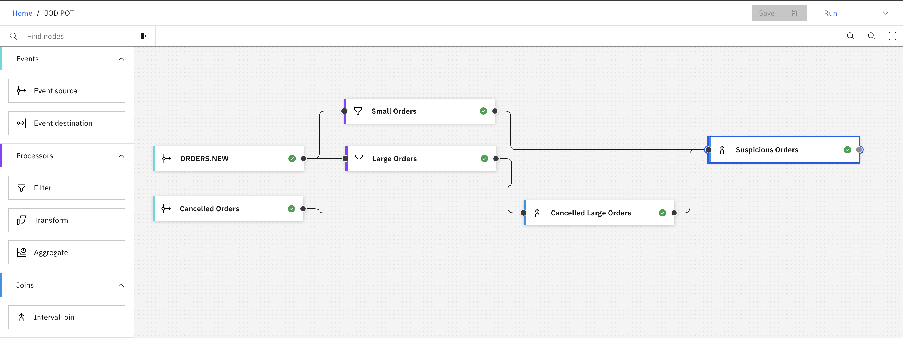

# LAB 03 A - Event Processing

This is a more advanced lab, where you will be able to explore Event Processing on your own, and try to find a solution to a specific scenario.

## Use-Case Overview: Detecting Suspicious Orders in Real-Time

In this lab, we will explore a retail use-case focused on detecting suspicious orders for an online jeans store.

### Scenario:

We operate an online jeans store where customers who make substantial purchases are eligible for valuable discounts on their next transaction. However, we've noticed a troubling pattern where some customers initially place a significant order but then change their behavior by making smaller orders and canceling the initial large purchase.

### Objective:

Our primary goal is to identify and address these irregular activities in real-time. By doing so, we ensure the integrity and efficiency of our online retail operation.

In this lab, we'll delve into the details of real-time event processing and anomaly detection to maintain the reliability and integrity of our business. Let's explore the strategies and tools to keep our online jeans store running smoothly and safeguard it from deceptive practices.

## Suspicious Orders Details

1. A large order has a value of €50.00 or more.
2. A small order has a value of less than €50.00.
3. A suspicious order would be considered the following: a large order that has been cancelled between 0 and 30 minutes after the order has been placed. In the meanwhile, a smaller order has been placed by the same customer.

> [!NOTE]
> The image above shows an example flow where this scenario was implemented. You can also find an example flow in [Assets](./resources/assets/Suspicious%20Orders.json).
