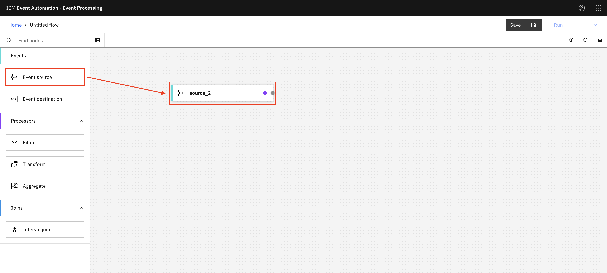
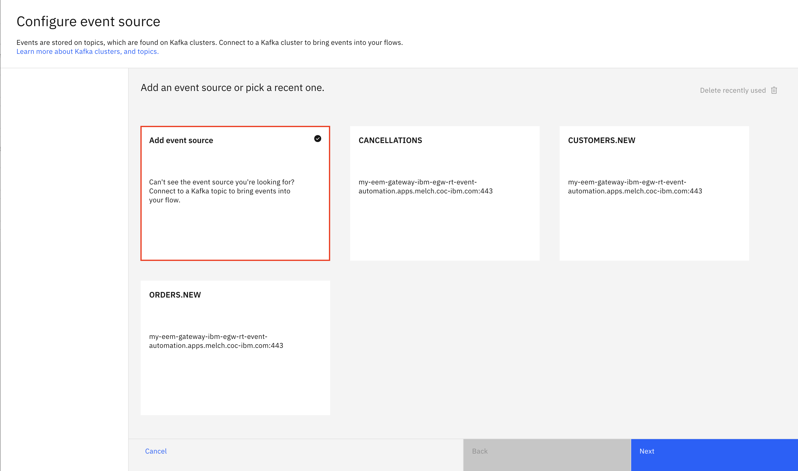
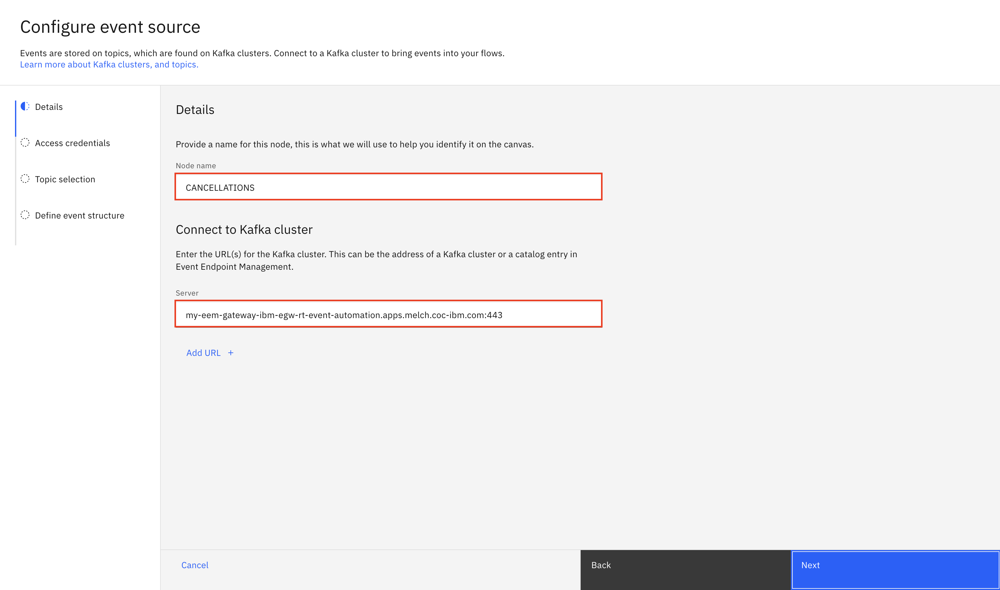
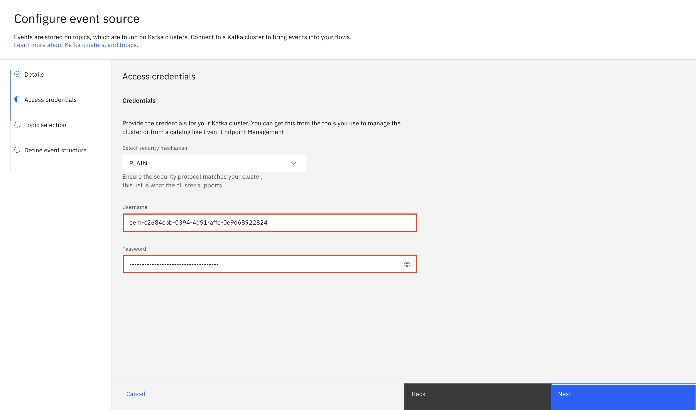
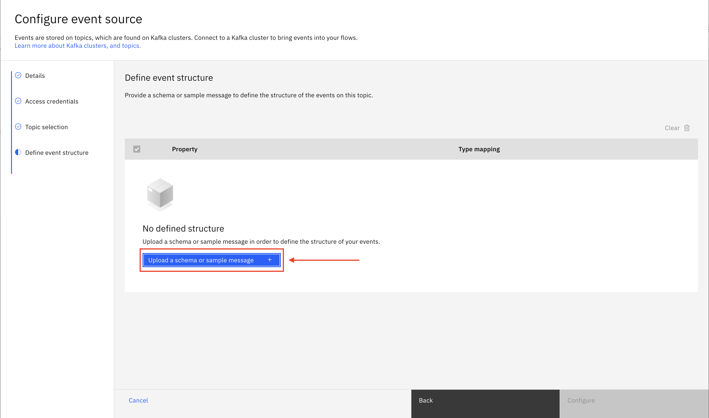
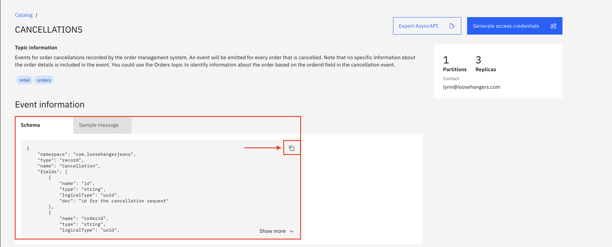
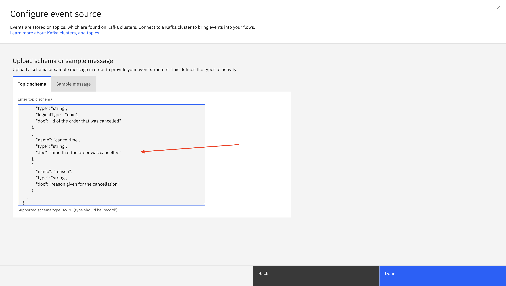
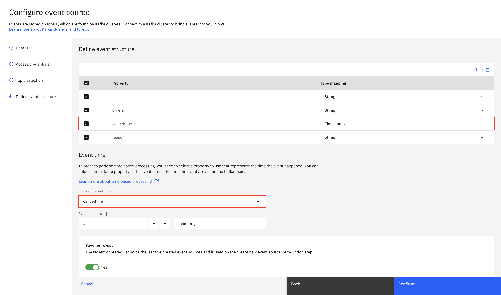

# LAB 03 B - Event Processing

In this lab, we are going to explore how to add and configure an **Event Source** node in **Event Processing**.

For this lab, all the event sources should have been pre-configured already for you. As we are using the same user credentials with many people, someone could potentially remove one of the pre-configured **Event Sources**.

In this case, this lab will help you create and configure an Event Source node from scratch.

## Add and configure a new Event Source

1. You should already be logged in and have created an empty flow in Event Processing. If not, refer to [LAB 03](../README.md).

2. Drag and drop an **Event Source** node onto the canvas.

3. With your mouse, hover over the newly added node, and click **Edit**.

4. Here, you should see a list of pre-configured event sources, but in case one is missing, click **Add event source**. Click **Next**.

5. In another browser tab, navigate to **Event Endpoint Management** and from the catalog, select the topic you want to add as an Event Source in Event Processing. Locate and copy the **server URL** under **Access information**.

> [!NOTE]  
> Event Endpoint Management URL

6. Go back to the Event Processing User Interface and enter a meaningful **Node name** and add the **Server URL** you just copied. Click **Next**.

7. Accept the **Self-Signed certificated** and click **Next**.

> [!NOTE]  
> We have already provided credentials for 3 topic (ORDERS.NEW, CUSTOMERS.NEW and CANCELLATIONS) in the separate credentials file. In case you want to add another topic, refer to [LAB 02 Event Endpoint Management](../../Lab_02_Event_Endpoint_Management/) for creating topic credentials. Otherwise, copy the credentials from the credentials file.

> [!NOTE]  
> Refer to `Event Endpoint Management: Topic Subscriptions` for the EEM credentials.

8. Fill in the **Username** and **Password** fields, and click **Next**.

9. The topic you have access to, should be automatically selected. Click **Next**.

10. Select **Upload a schema or sample message**.

11. Navigate back to **Event Endpoint Management** and copy the schema from the **Event Information**.

12. Paste the schema you just copied in the **Topic Schema** box. Click **Done**.

13. Make sure to select `Timestamp` for Date & Time properties. Next, make sure to select this property as `Source of event time`. This will allow us to work with time-based events. Keep **Save for re-use** enabled to re-use your connection when adding new event sources. Select **Configure**.

> [!WARNING]  
> For the 3 topics we use in this lab you can select the following properties:  
> **ORDERS.NEW**: `ordertime`  
> **CANCELLATIONS**: `canceltime`  
> **CUSTOMERS.NEW**: `registered`

Your new event source has now been configured. Next time you add an event source node onto the canvas, you should be able to re-use your pre-configured event source.

---

### Labs Overview

| Lab           | Location                   | Description                  |
| ------------- | -------------------------- | ---------------------------- |
| Labs Overview | [Labs Overview](../../../) | Go back to the labs overview |
