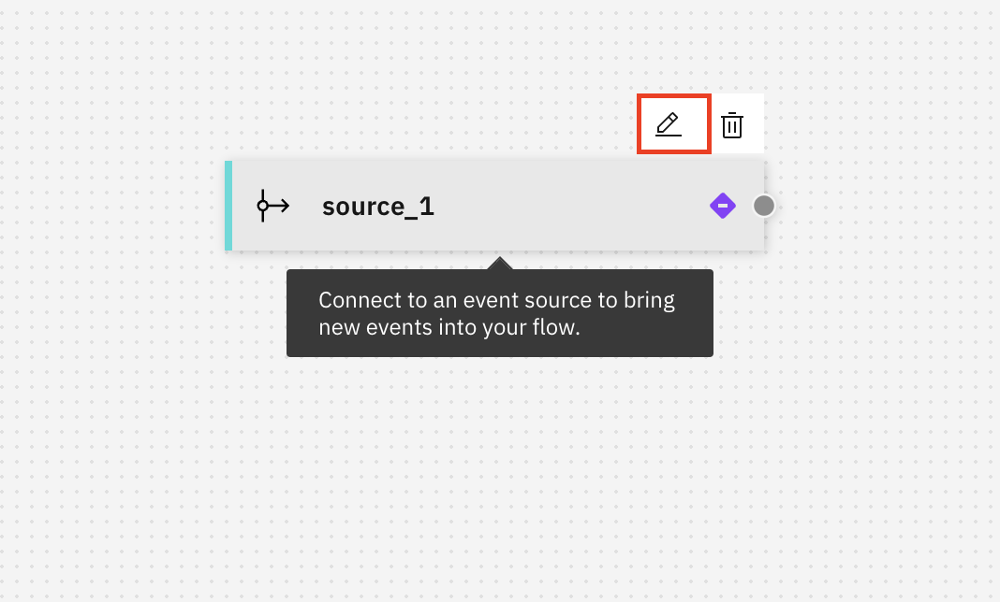

# LAB 03 - Event Processing

In th is lab, we will explore the **IBM Event Processing** capability, which is part of the [**IBM Event Automation**](https://www.ibm.com/products/event-automation) offering. The purpose of this lab is to show you the value of Event Processing and give you a hands-on experience with an easy to follow guide.

## Event Processing: Introduction

**Event Processing** is a scalable, low-code event stream processing platform that helps you transform and act on data in real time.

Event Processing transforms event streaming data in **real time**, helping you turn events into **insights**. You can define flows that connect to event sources which bring event data (messages) from Apache Kafka into your flow, combined with processing actions you want to take on your events.

The flows are run as [Apache Flink](https://flink.apache.org/) jobs. Apache Flink is a framework and a distributed processing engine for stateful computations over event streams. In addition to being the processing engine for Event Processing, Flink is also a standalone engine you can run custom Flink SQL workloads with.

### Features

Event Processing features include:

- A user interface (UI) designed to provide a low-code experience.
- A free-form layout canvas to create flows, with drag-and-drop functionality to add and join nodes.
- The ability to test your event flow while constructing it.
- The option to import and export flows in JSON format to reuse across different deployment instances.
- The option to export the output of the flow processing to a CSV file.

> [!NOTE]
> IBM Event Processing is part of IBM Event Automation. To read more about Event Automation, navigate to: [Event Automation](https://www.ibm.com/products/event-automation). For more information on Event Processing: [Event Processing](https://ibm.github.io/event-automation/ep/).

## Use-Case Overview: Detecting Suspicious Orders in Real-Time

In this lab, we will explore a retail use-case focused on detecting suspicious orders for an online jeans store.

### Scenario:

We operate an online jeans store where customers who make substantial purchases are eligible for valuable discounts on their next transaction. However, we've noticed a troubling pattern where some customers initially place a significant order but then change their behavior by making smaller orders and canceling the initial large purchase.

### Objective:

Our primary goal is to identify and address these irregular activities in real-time. By doing so, we ensure the integrity and efficiency of our online retail operation.

In this lab, we'll delve into the details of real-time event processing and anomaly detection to maintain the reliability and integrity of our business. Let's explore the strategies and tools to keep our online jeans store running smoothly and safeguard it from deceptive practices.

## Event Processing: Lab Introduction

In this lab you will discover the main capabilities provided by Event Processing.

- Part 1 - Create an **Event Processing flow** and connect to an **event source** to bring events into your flow
- Part 2 - **Filter** event sources to discard events in the stream that don't match a specific condition
- Part 3 - **Join** events by combining two streams of events that match a condition within a time window
- Part 4 - **Transform** events by renaming and removing properties in events and create new properties
- Part 5 - **Aggregate** events to perform calculations on groups of events within a time window
- Part 6 - Connect to an **event destination** and write your (processed) events to it, allowing others to work with those events

### Part 1 - Create a flow and connect to an event source

#### 1. Logging in to the Event Processing platform

The _URL_ for Event Processing should have been provided seperately. Navigate to the user interface and you should be navigated automatically to the login page, if you didn't login previously.

> **[Event Processing URL]**

1. Open the **Event Processing URL**.

  

2. Fill in the Event Processing _username_ anc click **Continue**.
3. Fill in the Event Processing _password_ and click **Log In**.

> **[Event Processing Username]** **[Event Processing Password]**

You should now be logged in and see the _Welcome to Event Processing_ page.

On the Event Processing dashboard, you will see different tiles. The most important tile if for creating or importing flows. The other tiles will guide you to Event Processing [tutorials](https://ibm.github.io/event-automation/tutorials/) and product [documentation](https://ibm.github.io/event-automation/) pages.

Below, we have an overview of all the flows we created. We can find flows by entering a search or by filtering by date or status, or create or import a flow.

Now that we are logged in, let's start by creating our first Event Processing flow!

---

#### 2. Creating an Event Processing flow

1. Click **Create +** to start creating a new flow.

  

2. Enter a meaningful name and description.

> [!IMPORTANT]
> Give your credentials a meaningful name and description. Use the pattern `<Initials> POT` for the name.
> If my name would be John Doe, I would name my flow: **JOD POT**.

  

3. Click **Create** to create your flow.

You have now created an empty flow.

The user interface allows us to:

- Collapse / open the **nodes palette**
- Search for nodes
- **Drag and drop** nodes onto the canvas
- Explore the **documentation** pages (**Learn more**) for building a flow
- Execute flow actions: **Save** or **Run** a flow

Let's start by adding our first node onto the canvas.

4. Drag and drop an **Event Source** node onto the empty canvas.

  

5. With your mouse, hover over the node that you dragged onto the canvas, and click the **edit** button (the pencil icon above the node).

> [!WARNING]
> When you previously connected to an event source, the event source will show up as a tile and will already be configured. You can re-use those connections and don't need to recreate the connections from scratch every time. For the purpose of this lab, let's re-use those connections. `PLEASE DON'T DELETE RECENTLY USED CONNECTIONS`, so that others can easily re-use those connections during this lab.

6. Click **ORDERS.NEW** and click **Next**.

Here, you can review the properties and property types and also select the source of event time, in order to be able to perform time based processing.

7. Keep the defaults and click **Configure**.

  

8. With your mouse, hover over the node that you previously dragged onto the canvas, and click the **edit** button (the pencil icon above the node).

We will now rename the event source node and review all the properties associated with this event source.

9. Give the **Node name** a meaningful name like `ORDERS.NEW` so that we easily recognize our node onto the canvas later, and click **Next**.

> [!WARNING]
> For this POT, we are making use of self-signed certificates. In order to continue, we will need to trust our self-signed certificates.

10. Click `Accept Certificates` to accept the self-signed certificates, and click **Next**.

11. Keep the pre-configured credentials and click **Next**.

12. You should only see the `ORDERS.NEW` topic and it should be selected. Click **Next**.

12. Here, we can validate all our properties and source of event time again. Let's keep the defaults and click **Configure**.

Now, we renamed our first node to `ORDERS.NEW`. Let's continue the lab and explore what we can do with the New Orders events in real-time.

### Part 2 - **Filter** events
