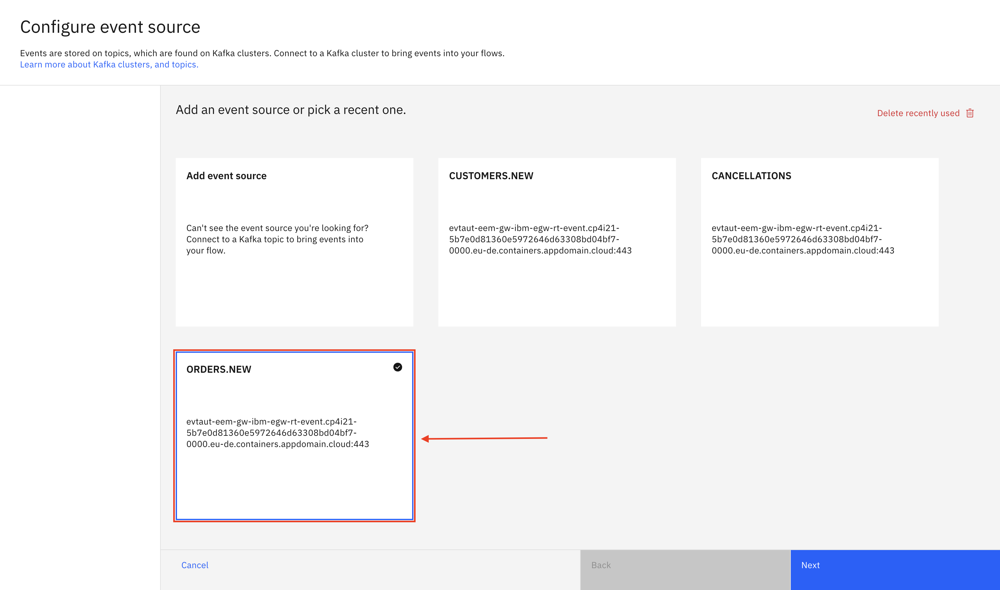
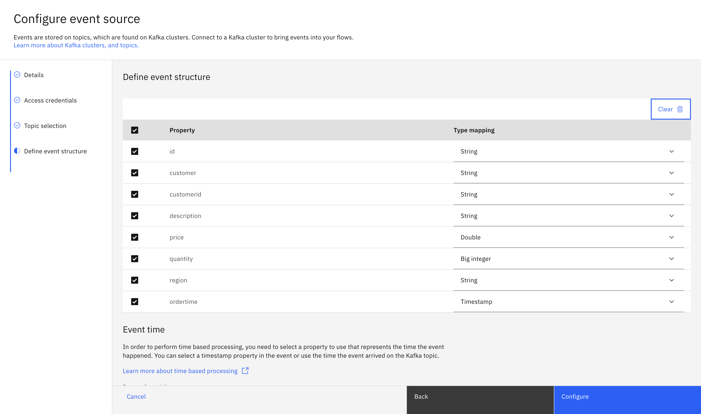
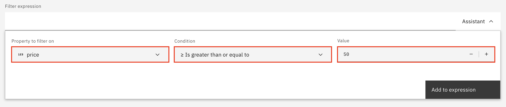
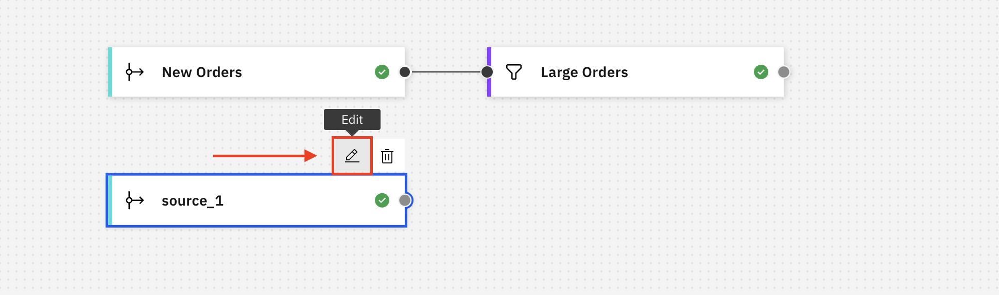

# LAB 03 - Event Processing

In th is lab, we will explore the **IBM Event Processing** capability, which is part of the [**IBM Event Automation**](https://www.ibm.com/products/event-automation) offering. The purpose of this lab is to show you the value of Event Processing and give you a hands-on experience with an easy to follow guide.

## Event Processing: Introduction

**Event Processing** is a scalable, low-code event stream processing platform that helps you transform and act on data in real time.

Event Processing transforms event streaming data in **real time**, helping you turn events into **insights**. You can define flows that connect to event sources which bring event data (messages) from Apache Kafka into your flow, combined with processing actions you want to take on your events.

The flows are run as [Apache Flink](https://flink.apache.org/) jobs. Apache Flink is a framework and a distributed processing engine for stateful computations over event streams. In addition to being the processing engine for Event Processing, Flink is also a standalone engine you can run custom Flink SQL workloads with.

### Features

Event Processing features include:

- A user interface (UI) designed to provide a low-code experience.
- A free-form layout canvas to create flows, with drag-and-drop functionality to add and join nodes.
- The ability to test your event flow while constructing it.
- The option to import and export flows in JSON format to reuse across different deployment instances.
- The option to export the output of the flow processing to a CSV file.

> [!NOTE]
> IBM Event Processing is part of IBM Event Automation. To read more about Event Automation, navigate to: [Event Automation](https://www.ibm.com/products/event-automation). For more information on Event Processing: [Event Processing](https://ibm.github.io/event-automation/ep/).

## Use-Case Overview: Identify new customer orders in real-time

### Scenario:

In this Lab, we are going to create an event processing flow for the sales team. They want to be able to identify new customers who make their first large order within 30 minutes of creating an account, so that they can contact them with a special offer.

### Objective:

Our objective of this event processing flow is to enable the sales team to identify and reach out quickly to new customers who place their first large order within 30 minutes of creating their account. By doing so, the team aims to provide these new customers with a special offer, enhancing customer engagement and sales.

## Event Processing: Lab Introduction

In this lab you will discover the main capabilities provided by Event Processing.

- Part 1 - Create an **Event Processing flow** and connect to an **event source** to bring events into your flow
- Part 2 - **Filter** event sources to discard events in the stream that don't match a specific condition
- Part 3 - **Join** events by combining two streams of events that match a condition within a time window
- Part 4 - **Transform** events by renaming and removing properties in events and create new properties
- Part 5 - **Aggregate** events to perform calculations on groups of events within a time window
- Part 6 - Connect to an **event destination** and write your (processed) events to it, allowing others to work with those events

---

### Part 1 - Create a flow and connect to an event source

#### 1. Logging in to the Event Processing platform

The _URL_ for Event Processing should have been provided seperately. Navigate to the user interface and you should be navigated automatically to the login page, if you didn't login previously.

> **[Event Processing URL]**

1. Open the **Event Processing URL**.

  

2. Fill in the Event Processing _username_ anc click **Continue**.
3. Fill in the Event Processing _password_ and click **Log In**.

> **[Event Processing Username]** **[Event Processing Password]**

You should now be logged in and see the _Welcome to Event Processing_ page.

On the Event Processing dashboard, you will see different tiles. The most important tile if for creating or importing flows. The other tiles will guide you to Event Processing [tutorials](https://ibm.github.io/event-automation/tutorials/) and product [documentation](https://ibm.github.io/event-automation/) pages.

Below, we have an overview of all the flows we created. We can find flows by entering a search or by filtering by date or status, or create or import a flow.

Now that we are logged in, let's start by creating our first Event Processing flow!

---

#### 2. Creating an Event Processing flow

1. Click **Create +** to start creating a new flow.

  

2. Enter a meaningful name and description.

> [!IMPORTANT]
> Give your flow a meaningful name and description. Use the pattern `<Initials> POT` for the name so that we can easily find it afterwards.
> If my name would be John Doe, I would name my flow: **JOD POT**.

  

3. Click **Create** to create your flow.

You have now created an empty flow.

The user interface allows us to:

- Collapse / open the **nodes palette**
- Search for nodes
- **Drag and drop** nodes onto the canvas
- Explore the **documentation** pages (**Learn more**) for building a flow
- Execute flow actions: **Save** or **Run** a flow

Let's start by adding our first node onto the canvas.

4. Drag and drop an **Event Source** node onto the empty canvas.

  

5. With your mouse, hover over the node that you dragged onto the canvas, and click the **edit** button (the pencil icon above the node).

> [!WARNING]
> When you previously connected to an event source, the event source will show up as a tile and will already be configured. You can re-use those connections and don't need to recreate the connections from scratch every time. For the purpose of this lab, let's re-use those connections. `PLEASE DON'T DELETE RECENTLY USED CONNECTIONS`, so that others can easily re-use those connections during this lab.

6. Click **ORDERS.NEW** and click **Next**.

Here, you can review the properties and property types and also select the source of event time, in order to be able to perform time based processing.

7. Keep the defaults and click **Configure**.

  

8. With your mouse, hover over the node that you previously dragged onto the canvas, and click the **edit** button (the pencil icon above the node).

We will now rename the event source node and review all the properties associated with this event source.

9. Give the **Node name** a meaningful name like `New Orders` so that we easily recognize our node onto the canvas later, and click **Next**.

> [!WARNING]
> For this POT, we are making use of self-signed certificates. In order to continue, we will need to trust our self-signed certificates.

10. Click `Accept Certificates` to accept the self-signed certificates, and click **Next**.

11. Keep the pre-configured credentials and click **Next**.

12. You should only see the `ORDERS.NEW` topic and it should be selected. Click **Next**.

12. Here, we can validate all our properties and source of event time again. Let's keep the defaults and click **Configure**.

Now, we renamed our first node to `New Orders`. Let's continue the lab and explore what we can do with the New Orders events in real-time.

---

### Part 2 - **Filter** events

Now let's add a Filter node, to filter out the events that we don't need. In this case, we are interested in events with a value of €50.00 or higher.

1. Double click on the `Filter` node under Processors, or drag and drop the Filter node onto the canvas.

> [!NOTE]
> If you double click on a node in the nodes palette, it will automatically be put on the canvas and be connected to the last added node. So, you can either choose to drag and drop a node onto the canvas and connect the dots manually, or double click on a node and it will automatically be connected for you.

2. Once you added the filter node, hover over the filter node with your mouse and click on the pencil to **edit** the node.

3. Give the filter a meaningful name. For this example, let's name our filter: `Large Orders`. Click **Next**.

This view is where we are able to configure our filter and it really guides us through the configuration without the need for deep technical skills about Flink SQL.

We can open the **help** tab to give us more information about how a filter node works.

Below the Help function, we have the Filter expression. Here, we can manually enter an expression if we know Flink SQL, but we can choose to open the **assistant** at the right, to really guide us to configure the filter node.

For this lab, let's use the assistant. When using the assistant, the Flink SQL expression will be automatically provided for us.

4. Click on `Assistant` to open the assistant.

5. Choose `price` as the property to filter on, `>= Is greater than or equal to` as the condition, and fill in `50` as the value. Now click **Add to expression**.

> [!NOTE]
> We have now configured an expression that will filter out all the events with a **price lower than €50.00**.

6. Click **Configure** to finish editing the expression.

You should now see that the Large Orders filter was renamed to **Large Orders**.

> [!NOTE]
> When creating Event Processing flows it is important to regularly test our flows during creation, so we can be sure that our flow is doing what we expect. Event Processing allows us to **run** flows during creation, which means that we can immediately see the results of our flow.

7. In order to test our flow, let's click **Run**, now click **Include historical**, and finally click on the `Large Orders` node.

> [!IMPORTANT]
> Make sure to select Run --> Include historical to visualise the data, based on historical data instead of only running it based on events from now. This will make sure we don't need to wait for new **Large Orders** to come in, but rather show us an overview of all previous large orders.

Have a look at the events in the table. We should only see orders with a value of €50.00 and more. We can navigate through the results, or click the pause putton to pause streaming and download a CSV with the results we collected.

This feature really allows us to quickly visualise our results or to download a CSV report for further processing. In a later phase of this lab, we will explore how to collect the processed results and put them on a new Kafka Topic for further automation.

8. Click **Stop** in the upper right corner to stop running the flow.

Now, let's have a look at how we can add another source of events and join those two event sources together.

### Part 3 - **Join** events

#### Add the New Customers event source

First, let's add the New Customers event source, so that we can later join those events to the Large Order events.

1. Drag and drop a second `Event Source` node onto the canvas.

2. Hover over the newly added **Event Source** with your mouse, and click **edit**.

3. Select `CUSTOMERS.NEW` and click **Next**.

4. Keep the default properties and type mappings and click **Configure**.

  

> [!WARNING]
> If you receive a Validation error, indicating that all sources must be connected to the same graph, this is normal and it just informs you that the Event Source should be connected to another node. We will fix this in a minute.

  

5. Hover over the newly added **Event Source** with your mouse, and click **edit**.

We will now rename the event source node and review all the properties associated with this event source.

9. Give the **Node name** a meaningful name like `New Customers` so that we easily recognize our node onto the canvas later, and click **Next**.

> [!WARNING]
> For this POT, we are making use of self-signed certificates. In order to continue, we will need to trust our self-signed certificates.

10. Click `Accept Certificates` to accept the self-signed certificates, and click **Next**.

11. Keep the pre-configured credentials and click **Next**.

12. You should only see the `CUSTOMERS.NEW` topic and it should be selected. Click **Next**.

12. Here, we can validate all our properties and source of event time again. Let's keep the defaults and click **Configure**.

The Event Source node should now have been renamed to **New Customers**. Let's continue and join our New Customer events and Large Orders events together.

#### Join the orders and customers events

Now that we added our New Customers event source, let's create the Interval Join to join both events together.

1. Drag and Drop an `Interval Join` node onto the canvas. Now, combine the **Large Orders** node with the **Interval Join** node by clicking on the Output Port of the Large Orders node (the small dot at the right of the node), and dragging it towards the Input Node of the Interval Join (the small dot at the left of the node) before releasing the mouse button.

2. Combine the **New Customers** node with the **Interval Join** in the same way you combined the **Large Orders** with the **Interval Join**.

  

3. Hover over the newly added **Interval Join** node with your mouse, and click **edit**.

4. Give the **Interval Join** a meaningful name like `Large New Customer Orders` so that we easily recognize our node onto the canvas later, and click **Next**.

Here, we will need to add our Join condition, meaning that we tell the Interval Join node how to correlate the stream of order events with the stream of customer registration events.

5. Click on the **Assistant** to help us create the join condition. For the **Specify property from New Customers** select `customerid`, for the **Specify property from Large Orders** also select `customerid`. Click **Add to expression**.

You should now see the Flink SQL expression.

6. Click **Next**.

> [!NOTE]
> An interval join is used to merge event sources when matching events happen within a given time window.

To configure the join between these two streams, we need to specify the time window that you are interested in. For this lab, we are creating a flow to identify order events that occur within 30 minutes of a new customer registration event.

The user interface will give us a nice visualisation of the time window condition so that we know exactly what we are configuring.

> [!NOTE]
> To learn more about joins, navigate to [Joins](https://ibm.github.io/event-automation/ep/nodes/joins/).

7. For the **Event to detect**, select `Large Orders (ordertime)`. For the **Event to set the time window**, select `New Customers (registered)`. Finally, for the **Offset from event to end the time window**, enter `30`. Click **Next**.

In the final step, we will need to configure the properties we want to remove after the join. We can also rename properties to match our preference or so that we don't have duplicate property names.

Let's rename and remove some properties.

> To rename a property, **click on the property name**, **start editing** the property name and finally **click outside** the property name box.

> To remove a property, **click on the minus sign** next to the property name. You can add them back later if required by **clicking the plus sign** next to the removed properties.

8. Click the minus (“Remove property”) button next to **every property** to clear the output properties.

| Property name    | Original name | Source        |
| ---------------- | ------------- | ------------- |
| id               | customerid    | New Customers |
| name             | customername  | New Customers |
| signup time      | registered    | New Customers |
| first order time | ordertime     | Large Orders  |
| price            |               | Large Orders  |
| region           |               | Large Orders  |

9. Add the required properties and rename them appropriately. Click **Configure**.

Now let's test the flow, to make sure we get the results we expected.

10. Click **Run**, then **Include historical** to test the flow. Click on the **Large New Customer Orders** node and wait a couple of seconds to see the first results come in.

Some results should start coming in. We should only see results with a price >= 50.

11. Click **Stop** to stop the flow.

### Part 4 - **Transform** events

For the new stream of events that our flow will emit, it will be helpful to include a new property that calculates how quickly after registering, the new customer made their first order.

Let's create a transform node and add a property that calculates the time between the register date and the first order date.

1. From the nodes palette, `double click on Transform` to add a transform node, or drag and drop a Transform node onto the canvas and connect it with the Large New Customer Orders node.

2. With your mouse, hover over the transform node and click **Edit**.

3. Name the node `Time To First Order`. Click **Next**.

4. Click **Create new property** to start creating the new property.

Here, we will add a new property and configure an expression for calculating the number of minutes between registering and making a first order.

5. Name the new property `min before first order`. Click on the **Assistant** to help you build the expression. Select the `TIMESTAMPDIFF` function. For the **timepointunit** choose `MINUTE`, for the **timepoint1** choose `signup time` and for the **timepoint2** choose `first order time`. Click **Insert into expression**.

6. You should now see the Flink SQL expression. Click **Next**.

7. There are no properties to remove, so click **Configure**.

The Time To First Order (Transform) node has been configured and can now be tested.

8. Click **Run** and **Include historical** in the top right corner. Click the **Time To First Order** node to see the results and confirm that the new property is computed correctly.

9. Click **Stop** to stop the flow.

### Part 5 - **Aggregate** events

We can use an aggregate node to divide the stream of events into time-based chunks and then run an aggregate function on each of these chunks

For this lab, let's see how we can use an aggregate node to compute the **number of Large New Customer Orders** by **region** per **day**.

1. **Double Click** on the `Aggregate` node in the palette.

2. Hover over the newly added node and click **Edit**.

3. Enter a recognizable name for the node, like `Orders By Region`. Click **Next**.

4. For the time window property, select `first order time`. For duration of time window, select `1 Day(s)`. Click **Next**.

5. Now, select `COUNT` for the **aggregate function** and `id` for the **Property to aggregate**. Select `region` for the **additional property to group by**. Click **Next**.

6. Remove the `aggregateStartTime` and `aggregateEndTime` properties by clicking on the **minus sign** next to the properties. Rename **COUNT_id** into `sales`.

7. The **Orders By Region** node has now been configured. Let's test that we receive the expected results. Click **Run** and **Include historical** in the upper right corner. Click **Orders By Region** to see the results and confirm the results.

8. Click **Stop** to stop the flow.

### Part 6 - Connect to an **event destination**

[TODO]
